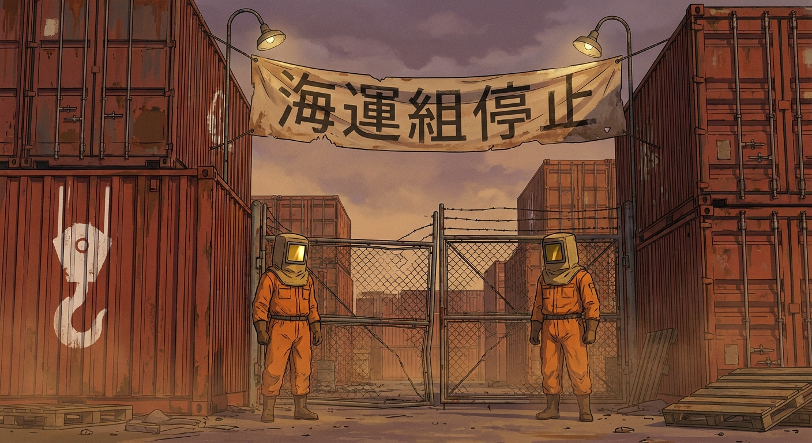
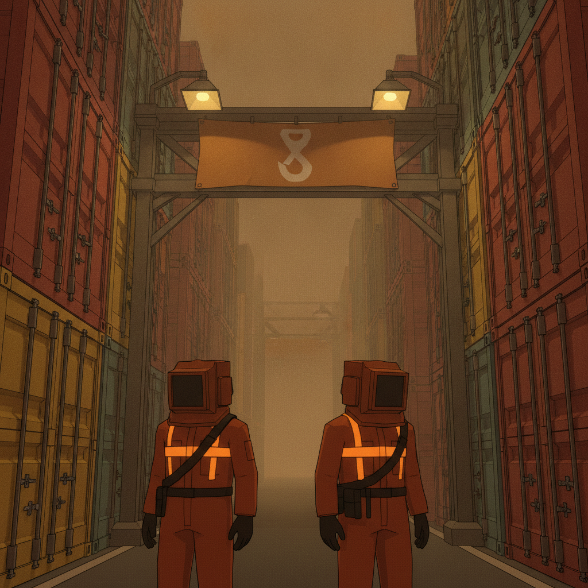
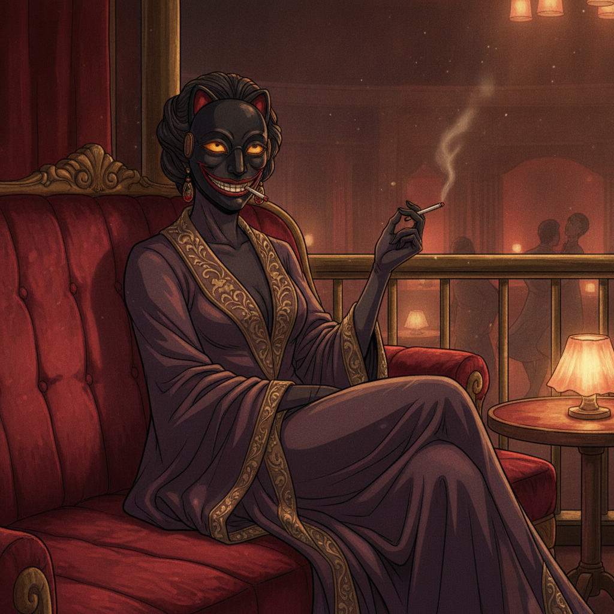
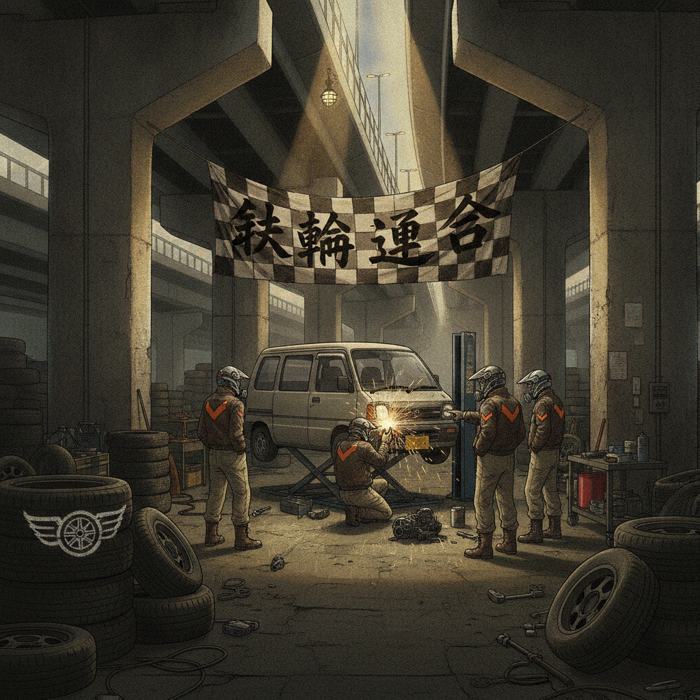
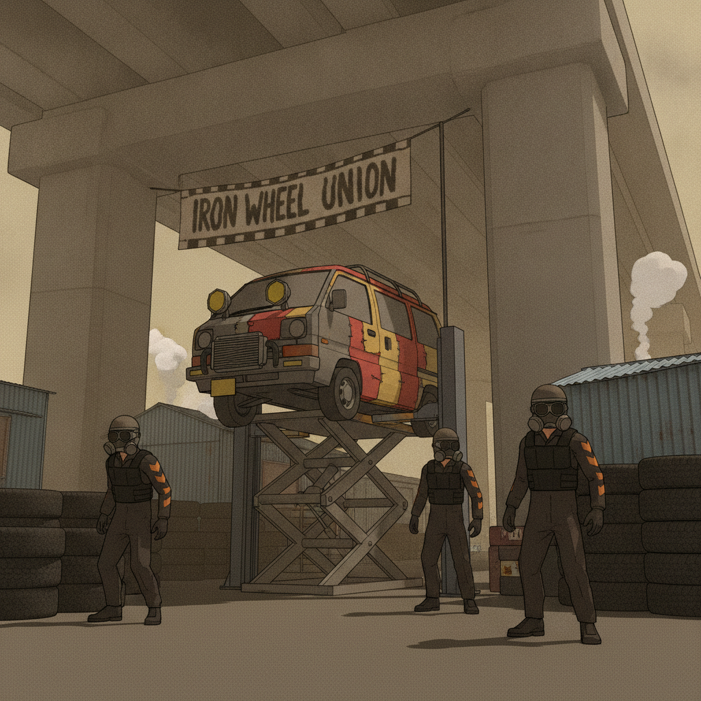
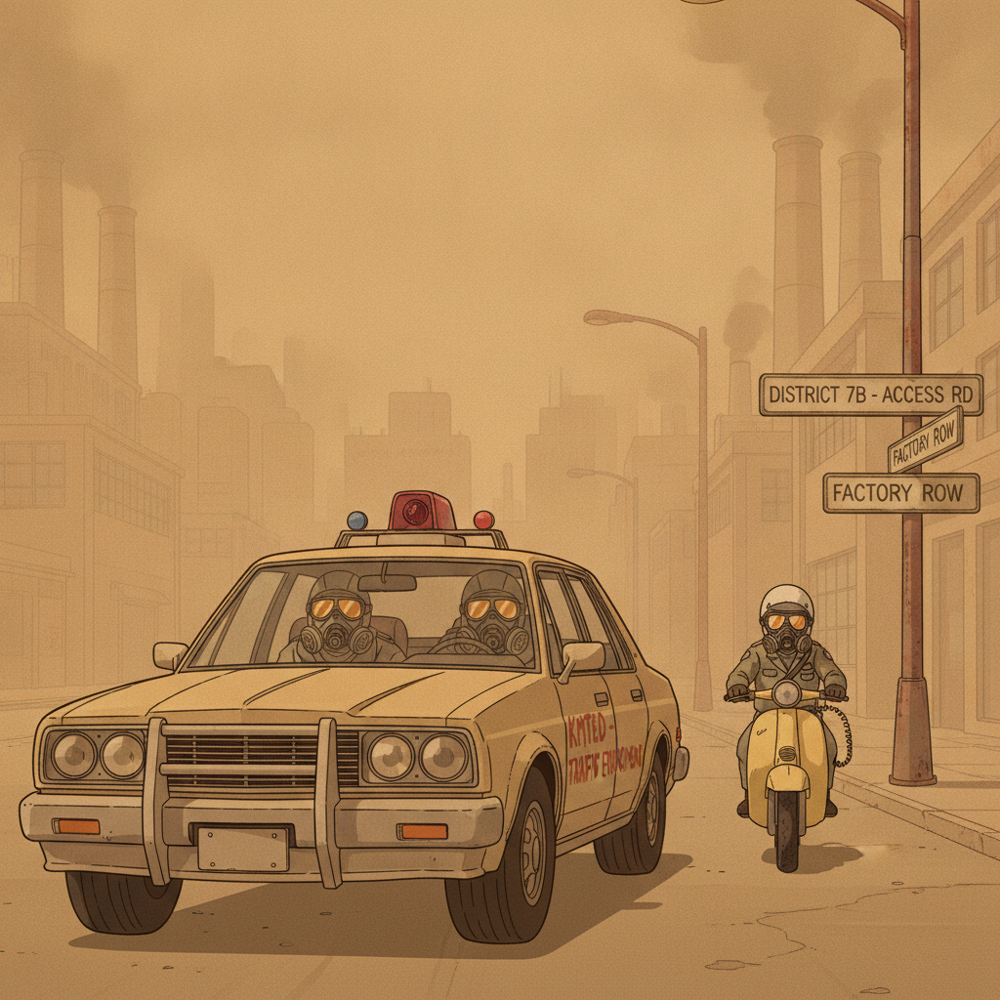
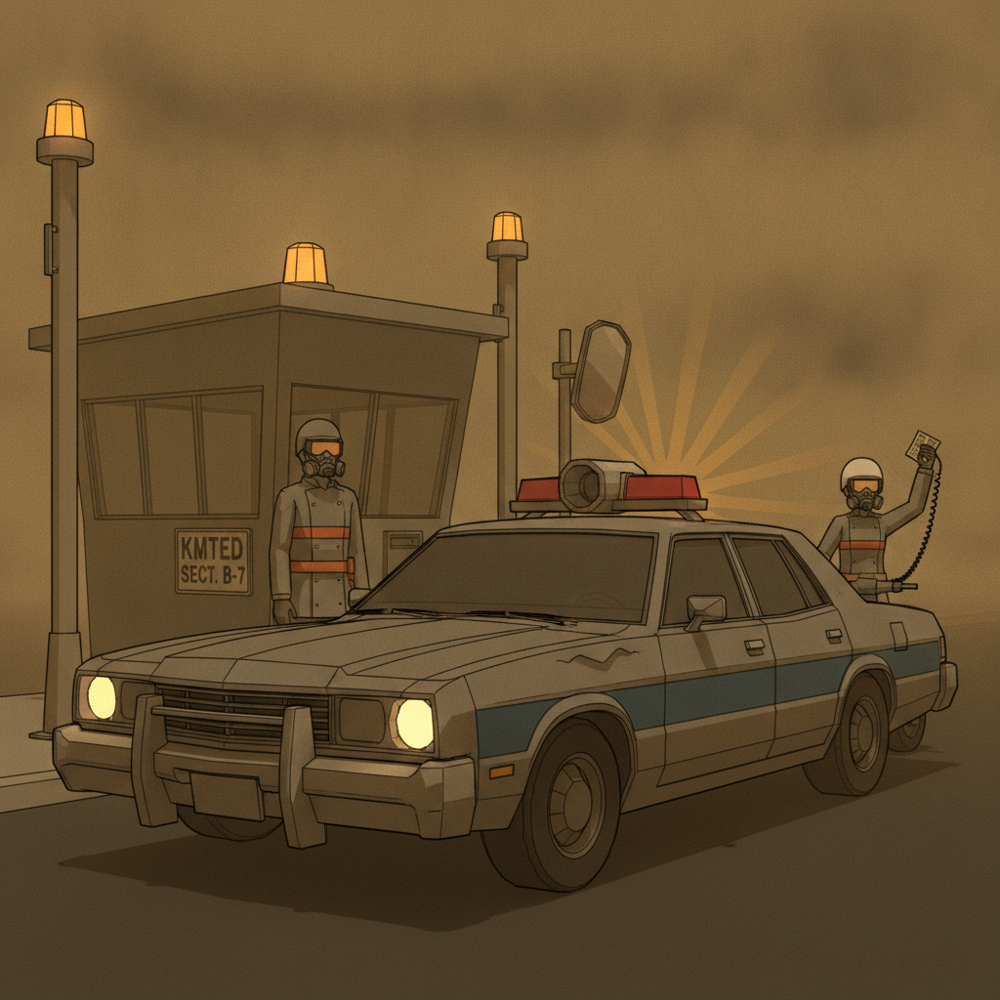
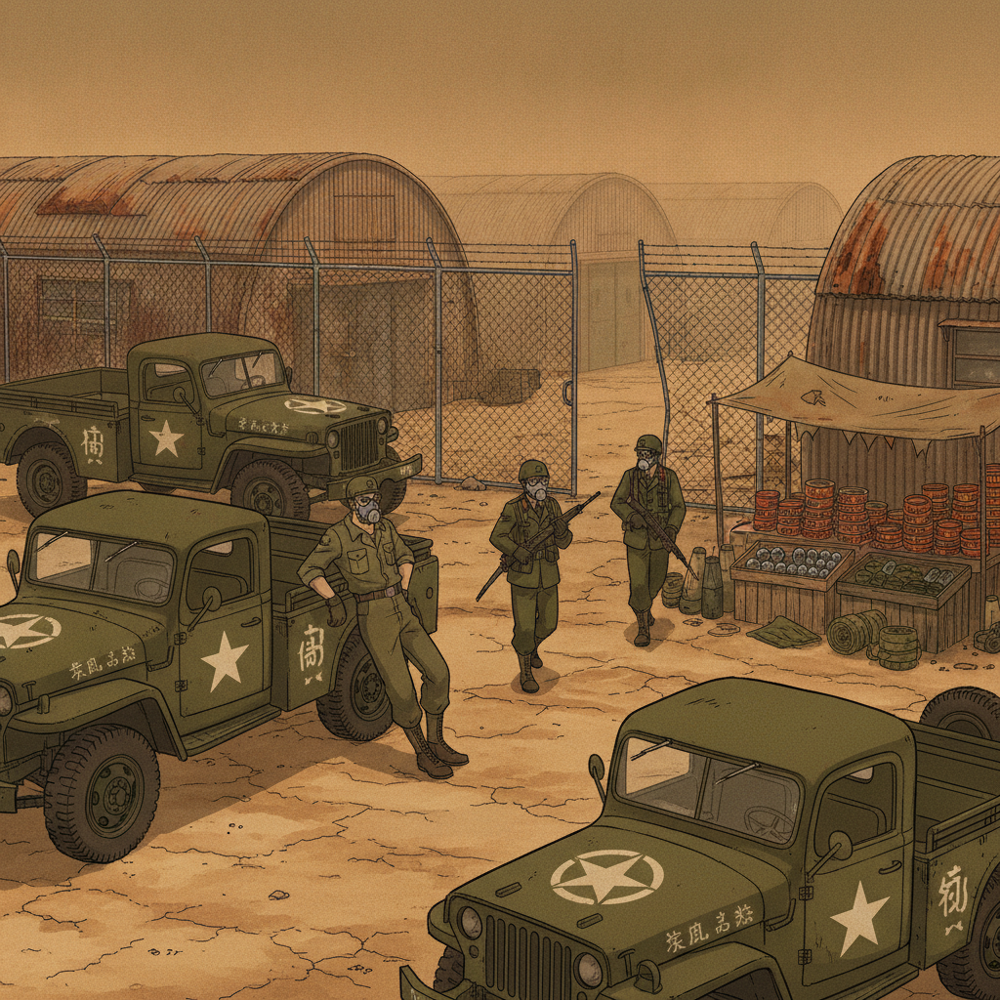

# FACTIONS — Art Book Chapter
### KUROGANE BAY / Tokyo Drift 3D gig-driver game

*World law first: no faction is "the mafia." Each has a civilian economic origin — dockers, cabaret owners, fishmongers, drivers. Wars are over **drivable logistics chokepoints** (customs gates, cold-chain, elevator terminals, panel fields), never abstract turf. Every faction's street presence must read at **100 m visibility** — banner colors, vehicle liveries, checkpoint architecture. Character law: **no unmasked faces, ever.** Tone law: the world takes itself 100% seriously — comedy emerges from systems only; nothing in this chapter is a punchline.*

**Reading key (per faction):** LOOK (colors, insignia, mask/uniform design) · VEHICLES (livery) · TURF (where they read on the street) · THE WHEELMAN (how they hire, threaten, or tolerate the player).

**Mock layers (Craig 2026-10-05):** every scene carries two mock layers — **[REFERENCE]** (aspirational, painterly, art-directed) and **[IMPLEMENTATION]** (what the shipped Godot game actually renders under the AnimeLook module: flat-shaded low-poly, ink outlines, 2-band cel shading, warm umber shadows, dust fog). Each scene's implementation note records what survived production translation, what was cut, and honest flags where the reference cannot survive.

> **A note on method.** At 100 m through dust you cannot read a badge — you read **silhouette geometry, luminance contrast, and material motion.** Every faction below was designed to be identified by those three channels before you ever read its insignia. (Gemini design consultation digested throughout; consult notes in `consult/gig-city/factions-design/`.)

---

## 1. KAIUN-GUMI — 海運組 · The Ocean Transport Syndicate

*[REFERENCE] Freight Gate 4, Daikoku Piers. The banner says what the enforcers don't have to.*

*[IMPLEMENTATION] What the shipped game actually renders: flat-shaded low-poly, ink outlines, cel bands, warm umber shadows, emissive T-bar piercing the fog.*

**Production translation.** What survived: the sodium-orange coverall blocks, the glowing T-bar chest band (authored as an emissive/unshaded component — the most fog-proof ID channel per the consult), the square box-hood silhouettes, the hook banner as a big orange field. What was cut: crane-hook stencils on uniforms (dead at 100 m — a 4×4-pixel gray smudge; decals are fill-rate poison on mobile TBDR), canvas wrinkles (coveralls become rigid low-poly cylinders). Honest flag: the hook emblem itself is only legible under ~40 m — at 100 m the read is the banner's orange field and the gooseneck lamp pools, not the stencil. Faction readability: VERIFIED at 100 m.

**Origin.** Demobilized naval logistics crews and dockers who cleared harbor wreckage after the war; the brute-force masters of the waterfront. (Echoes the real Yamaguchi-gumi's 1915 dock-labor origins — energy, not history.)

**LOOK — top-heavy industrial bulk.** Kaiun reads as *mass*: padded tobi trousers billowing above the knee, heavy tool harnesses, weighted cargo-hook bandoliers that distort the shoulder line — the silhouette is a square. **Color discipline:** high-vis sodium-orange canvas against oxidized primer-red; a horizontal "T-bar" of industrial reflective tape across chest and back, the highest-luminance marker of any faction, readable as a glowing orange band at 100 m. **Masks:** sandblasting hoods and dual-canister mining respirators with square tinted viewports — the square window is their signature. **Insignia:** the crane hook, stenciled massive in whitewash on container walls and painted on canvas checkpoint banners. Enforcers wear the hook as a steel badge hammered flat from cut crane steel, bolted through the chest strap.

**VEHICLES — zinc-chromate workhorses.** Rough flatbeds and yard telehandlers in chalked zinc-chromate yellow, mud splatter below the axle line, the hook stenciled on the tailgate. Their pursuit vehicles are harbor tugs of the road — slow, unstoppable, built to push: when a Kaiun truck decides you're leaving the pier, you're leaving. The Oyabun's own staff car is a black 1960s naval staff sedan, one anchor painted on the hood, left headlight permanently dead.

**TURF — Daikoku Piers, outer anchorages, Freight Gates 1–9, near-shore panel arrays.** Checkpoint architecture: stacked ISO containers forming a gate, counterweighted gantry arms as a portcullis, canvas banners between pipe frames. On the street you read them by **the container canyon** — Daikoku's corridor roads narrow between stacked box walls, and every entrance carries the hook banner. At night the gates are lit by hooded gooseneck lamps on the banners, not floodlights. The near-shore panel arrays are theirs by "maintenance fee": Kaiun boats among the floats, orange hulls against the black panel sea.

**THE WHEELMAN — tolerated as cargo, tested as a driver.** The cab is sovereign ground (canon guardrail 4): Kaiun does not murder neutral drivers — the harbor's gray cargo still needs wheels. They hire the player for off-manifest container pulls, midnight "re-labeling" runs past port inspectors, and docker medical emergencies. Their test is nerve: Lieutenant Kuga's muscle gigs ask you to move silent faction members and ram rival scouts blocking dock chokepoints. **Oyabun Ryuzo "The Winch" Murata** (gravel-voiced, missing left ear, respirator; never seen without his winch-hook walking stick) respects drivers who don't flinch at a gate and sinks cars over unpaid harbor tolls — his favor is a tariff, not a friendship. A Kaiun gig never asks you to be fast. It asks you to be *punctual under weight*.

---

## 2. GOKURAKU-KAI — 極楽会 · The Paradise Society

*[REFERENCE] Madame Kanzaki, velvet office above the Starlight Lounge. The mask never comes off. No implementation layer commissioned this round — the highest-risk translation; see §10.*

**Production translation.** The lacquered-mask rank system survives as a **texture swap, not geometry**: one mask mesh for all ranks, footman (plain black) and inner circle (red smile + brass grille) packed into one atlas with an INSTANCE_CUSTOM / vertex-color UV offset in the custom shader. Modeling the smile or grille in geometry would collapse under the inverted-hull outline pass ("ink cancer" — inflated black clotted artifacts around the mouth). Kanzaki's amber goggles earn a dedicated head-mesh variant — chunky 8–12-triangle blockouts that break the external silhouette profile. Gold-leaf trim is cut from all geometry: at 30 m+ it becomes subpixel shimmer and inflates hull vertex counts — if it appears at all, it's a flat cel-specular MatCap mask, never metallic PBR (fog + mobile metallic reflections produce unnatural glow inside fog volumes). Honest flag: at 100 m through dust, only the dark vertical column silhouette survives — the lacquer quality, the red smile, and the brass grille are all under-40 m details. The reference portrait cannot survive as-is; read it as close-range character art.

**Origin.** Post-war black-market cabaret rings — dance halls, hostess bars, and show business built on hospitality, synthetic vice, and spectacle. They own the night by owning the *room*.

**LOOK — tall, vertical, fluid.** Where Kaiun is a square, Gokuraku is a *line*: tailored Showa-era trench coats and wide-lapel duster jackets worn unbuttoned, hems flapping in the dust drafts; footmen carry heavy-gauge long-handled umbrella-canes. **Color discipline:** deep bruised plum and charcoal black, metallic gold-leaf trim that catches the haze — the gold is their 100 m read, glinting off coat hems and banner edges. **Masks:** the house signature — lacquered *urushi*-black full-face shields, sleek featureless ovals with integrated brass acoustic grilles that catch specular light. **Madame Hanayo Kanzaki** wears the masterpiece: custom-lacquered black with a painted red smile, worn over amber goggles; she smokes thin charcoal cigarettes through a filter-slot. Her people identify by *the quality of the lacquer* — footmen wear plain black; the inner circle wears the red smile. **Insignia:** the peony, hand-brushed in white enamel on velvet windbreak panels and folding checkpoint screens.

**VEHICLES — lowered VIP sedans.** Long, low, black: stretched brutalist barges with full-width vacuum-tube taillights and chrome half-masks on the drivers — **Taro "Clean Towel" Inaba**'s immaculate club car is the archetype, white gloves on the wheel, scrubbing blood off leather between fares. No light bars, no noise: Gokuraku cars arrive silently and block your exit politely. Their checkpoint vehicles park *across* the alley mouth, hazard flashers clicking, a footman unfolding a velvet-paneled windbreak. The threat is entirely social: they never chase you; they simply make sure you have nowhere better to be.

**TURF — Chidori Neon Strip, North Canal motel row.** The one district where the dust thins enough for blade signs to cut through — vertical enamel-and-neon blade signs in cherry red and warm gold (canon: Chidori is the neon exception). Checkpoint architecture: folding velvet-paneled windbreaks, enamel peony plaques, hostesses' cloakroom mirrors at the curb — a checkpoint that looks like a *doorway*, which is the point. Their war with the Iron Wheel Union over the Chidori supply lines reads on the street as velvet screens vs. tire walls, a few blocks apart.

**THE WHEELMAN — recruited as an intelligence asset.** Kanzaki uses cab drivers as her gossip network and pays handsomely for eavesdropped passenger talk — the player's back seat is her wiretap. She hires VIP transfers, hostess escorts through rival turf, discreet drunk-exec pickups, and debtor chase-downs where the "chase" is mostly cornering someone socially. The relationship is *courtly and transactional*: she is never rude, never loud, and her favors compound like interest. Cross her and you don't get shot — you get *unbookable*: every club door in Chidori develops a sudden full-house problem when your car pulls up.

---

## 3. TSURU-KAI — 鶴会 · The Market Crane Brotherhood

**Origin.** Armed mutual-aid collective of fishmongers and grain peddlers who defended supply wagons during the Great Fuel Famine. The oldest civilian root of any faction — and the most ruthless, because hunger taught them arithmetic.

**LOOK — grounded, triangular, wet.** Low-slung and stable: stiff vulcanized rubber maekake aprons over padded thermal jumpsuits, **white knee-high rubber boots** — the highest-contrast element on the street, flashing against dark wet pavement at distance. **Color discipline:** stark marine-white and deep indigo-dyed hemp; the guild *kamon* (the crane) stenciled massive in whitewash across the apron belly for frontal identification. Fish blood and scale are *part of the uniform* — a clean Tsuru-kai enforcer is one who hasn't worked today, and nobody trusts one. **Masks:** marine salvage rebreathers and clear vinyl spray-hoods with external copper scrubbers — the copper tanks on the cheeks are their tell. **Insignia:** the crane kamon, brush-painted on every vertical surface in the ward in the morning and washed off the rivals' walls by noon.

**VEHICLES — flat-front work trucks.** Cab-over box trucks and refrigerated vans in indigo with white crane-roundel doors, vertical calligraphic *nobori* banners tied to the mirrors streaming behind them at speed — **material motion as ID**: no other faction trails cloth at 80 km/h. Fortifications on wheels: blue plastic fish-crate walls bound with hemp rope stacked on flatbeds. Their ice trucks run the dawn routes — catch them at 4 AM and the whole ward smells of the sea for a block.

**TURF — Kamome Wholesale Ward, North Rail Depots.** The wet-pavement labyrinth: seafood halls, cold storage, auction stalls, dust caked on every awning. Checkpoint architecture: interlocking fish crates and brine barrels bound with hemp rope, auction-hall gantries, the cold-chain gates — the war with Kaiun-gumi is fought *at the gates of the cold-storage customs*, and you read it on the street as crate barricades vs. container walls. The ward's morning soundtrack is the tuna auction chant under the hazard lamps; by 7 AM the streets are washed down and the Tsuru-kai aprons are hung out to dry — a hundred indigo flags marking claimed doorways.

**THE WHEELMAN — hired as cold-chain infrastructure.** Tsuru-kai gigs are timers with teeth: perishables on a clock (Kenji the Fish-King's million-yen tuna to Haibara before rigor mortis), restaurant resupply, cash-bag escorts before sunrise. They pay in *produce and credit*, not just yen: a driver in good standing eats from the auction floor and gets first call on the dawn runs. **"Abacus" Kenjiro Sato** (merchant apron, canvas dust hood, brass abacus — carried, not a gun) destroys rivals through debt, supply starvation, and razor-wire ambushes on supply avenues. He hires drivers the way he hires everything: on margin. Be late with his fish and the abacus beads click — and your next three gigs across the whole city quietly pay 10% less until the ledger balances. No threats. Arithmetic.

**Production translation (no mock this round — see §10).** The consult's verdict: the non-negotiable read is the stark white boot blocks (ground-level value contrast in fog) plus tall, rigid nobori banner cards on the trucks — and the cheapest cuts are the crane kamon on the apron belly and the copper scrubber canisters (boxy geometry at LOD0 only, culled by LOD2). Trap warning: the reference's streaming banners must NOT become cloth sim — rigid opaque low-poly cards with baked vertex-shader sway (`sin(TIME*freq + VERTEX.y)`), no bones, no alpha-cut edges (alpha kills TBDR tile performance). Honest flag: with no implementation mock commissioned, Tsuru-kai's 100 m read is consult-verified on paper, not proven in pixels — flagged for the next mock round (§9 #2).

---

## 4. IRON WHEEL UNION — 鉄輪連合 · The Tetsurin Alliance

*[REFERENCE] Repair Row, under the expressway. The checkered banner is older than the city charter.*

*[IMPLEMENTATION] What the shipped game actually renders: flat-shaded patchwork panels, ink outlines, twin filter-cone helmet profiles, right-side chevrons.*

**Production translation.** What survived: the asymmetric right-side hazard-orange chevrons (the directional heading read — the faction's cheapest and most reliable ID), the twin filter cones as real geometry (hexagonal prisms, ~12 tris each — they break the head circle into the insectoid wedge at LOD0/LOD1, flattening to texture at LOD2), the patched mismatched body panels as flat color blocks, the checkered banner as a rigid opaque card. What was cut: welded seams and patch stitching (sub-pixel dither under 2-band cel shading), fine stenciled part numbers. Ink-outline rule enforced: outlines only on base body masses — never on straps, antennas, or thin props (the "black clot" trap: hull inflation wider than the object leaves floating black splotches). Honest flags: (1) the banner's "IRON WHEEL UNION" lettering is legible only at mock distance — in production the checkered PATTERN is the read; the text dies past ~30 m; (2) one of the three figures wears chevrons on the wrong arm — the directional convention must be enforced per-instance in the asset pipeline, not left to chance. Faction readability: VERIFIED at 100 m (chevron side + filter-cone silhouette).

**Origin.** Rogue courier drivers, midnight drag-racers, and wildcat chop-shop mechanics who refused the harbor syndicates. The only faction born on the road itself — and **the player's natural early ally**.

**LOOK — kinetic asymmetry.** Forward-leaning, patched, moving: tight technical leather and canvas, external spine-protectors, single-shoulder utility slings, loose cargo straps that trail like *bosozoku* ribbons. **Color discipline:** asphalt gray broken by diagonal hazard-orange chevrons — but **only on the right limbs**, a directional-tracking convention from the racing days: in the dust you can tell which way a Union rider is *facing* by the chevron side. **Masks:** stripped motocross full-face helmets mated to industrial twin-cyclone dust filters — an insectoid, predatory profile; the twin filter cones are their silhouette signature. **Insignia:** the iron wheel itself, spray-stenciled on tire walls, lift arms, and garage doors in whitewash that never quite dries.

**VEHICLES — raw-weld patchwork.** Kei vans and scramblers with mismatched welded panels, exposed external oil-coolers, high-mounted yellow rally spotlights (the dust demands them). The livery is *process*: primer patches, weld beads, stenciled part numbers. No two Union cars match, and that's the point — the faction's visual identity is **visible maintenance**, the honest opposite of every other faction's uniform. The shop trucks carry the checkered banner tied to the antenna mast.

**TURF — Kotobuki Slums & Repair Row, the under-expressway ring, South Canal shallows, the Nagisa waystation.** Checkpoint architecture: tire walls, hydraulic scissor lifts as gates, hand-painted checkered banners strung between support columns. The under-expressway ring is their cathedral — tin-blue shanties under concrete, filter-rinse bays steaming, pirate radio masts on the girders. At the Nagisa waystation, the banner flies over the only fuel pumps on the long highway. Their rolling skirmishes with KMTED and Gokuraku extortion squads read on the street as **tire-wall barricades appearing overnight** and vanishing by dawn.

**THE WHEELMAN — home.** The Union is where gig drivers belong: the union card stamped on paper, upgraded at chop shops; parts-fetch timers, no-questions parcels, getaway runs, dust-filter service stops. **Boss Tetsu "Camshaft" Ogata** — grease-covered savant, steel-rod spine, welder's mask pushed up over a respirator, speaks in mechanic-jargon bursts — runs the garages like a temple and the roads like a sacred commons: drive well and earn his respect; try to regulate his garages and find your brake lines cut. Mariko "Zero-Gauge" Katsu's speed-trial gigs are the Union's entrance exam. The Union never threatens the player — it *tests* them, and the test is always the same: drive like the road matters.

---

## 5. KMTED — Kurogane Municipal Traffic Enforcement Division

*[REFERENCE] Factory Row, Section B-7. The cruiser wants a confession; the scooter wants your meter money.*

*[IMPLEMENTATION] What the shipped game actually renders: flat-shaded low-poly, flashing amber beacon as the fog-piercing read, masked figures.*

**Production translation.** What survived: the flashing amber roof beacon (authored emissive — the KMTED's #1 fog-proof read), the putty-gray sedan block with simplified municipal-blue door bands, the white bucket helmet + square respirator profile on both figures, the chunky hazard-orange belt stripe, the kōban booth with pneumatic bribe-chute slot. What was cut: badge numbers, fine belt piping, sedan greebles (all culled at distance), the cruiser's fine stencil lettering. Honest flag: in this mock the Meter Maid's scooter is mostly occluded behind the cruiser — production needs a dedicated readable scooter profile mock before vehicle modeling; the silent three-wheeler silhouette is her signature and it isn't proven here. Faction readability: VERIFIED at 100 m (beacon + helmet + belt stripe).

**Identity.** Bored, underpaid municipal officers in heavy, understeered pursuit sedans with mechanical roof sirens, dashboard dispatch radios, and push-bars. They don't shoot — they use **mechanical leverage and paperwork**: pull alongside, scrape paint, pin you against street furniture until the chassis is immobilized, then write you into the next fiscal quarter.

**LOOK — municipal beige.** Waxed-canvas uniforms gone gray with dust, peaked caps with respirators clipped to the brim (the masked kōban keeper's descendant), pigskin work gloves, brass whistles. **Color discipline:** municipal putty-gray with a single **hazard-orange belt stripe** — the stripe is the rank and the warning at once. **Masks:** standard-issue boxy respirators with amber lenses; officers stencil their badge numbers on the filter housing. **Insignia:** the KMTED roundel — a split-flap board glyph — stenciled on cruiser doors and kōban dust-lock booths in municipal blue, half-sanded off by the dust within a month.

**VEHICLES — understeer made steel.** Heavy 1970s pursuit sedans: mechanical roof siren (a chrome horn you can hear winding up through the dust), push-bar bumpers, hand-stenciled KMTED door markings, dented fenders, always one headlight dimmer than the other. Two-car pinning is the whole doctrine: solo cruiser tailgates and loudspeaker-barks (Heat 1: THE TICKET), two cruisers box and pin at toll bridges (Heat 2: THE RAM), heavy paddy wagons ram head-on with iron spike barricades at district borders (Heat 3: SEIZURE). And then there is **the Meter Maid**: unnamed, on a three-wheeled scooter, white helmet, mirrored goggles, respirator, ticket book on a coiled cord. Never speaks, only writes. The scooter is silent; the ticket flutters under your wiper before you notice she was there. The city's most feared antagonist is a parking enforcer — no writing required.

**TURF — everywhere the municipal map says it is.** Kōban dust-lock booths at major intersections (with the pneumatic bribe-chute slot), toll plazas, district borders. KMTED authority ends at corporate district borders — crossing a toll jurisdiction sheds heat, which is why every driver learns the border lines by heart. Their street presence is **the amber beacon**: blinking hazard beacons on poles at every intersection they claim, iron mirrors on poles, enamel sector signs. The kōban keeper never leaves the booth during storms; authority in Kurogane Bay is a *sealed fixture*, not a patrol.

**THE WHEELMAN — the friction in the machine.** Heat accrues through visible friction — tearing down pneumatic poles, blowing toll plazas, speeding past kōban, contraband multiplying everything — never for mere alley speeding. The player sheds heat by breaking line-of-sight for 8 seconds and killing the headlamps under an elevated rail bridge, crossing a toll jurisdiction, or firing a bribe envelope into a kōban's pneumatic receiver. **Inspector Kenichi Dan** (demoted traffic detective, cracked leather respirator, one amber lens missing) is the system's chaos agent: while he's riding as your fare, heat locks to zero — patrols salute, toll gates open — but he orders you to commit violations to settle personal beefs, and carrying syndicate contraband with him in the cab doubles the payout until heavy chassis damage triggers his glovebox contraband check. The KMTED is never the villain. It's the *rent*.

---

## 6. AMERICAN ARMY PRESENCE — **PROPOSED, NOT CANON**

*[REFERENCE] The treaty-port depot at the Daikoku perimeter. The fence is peeled open and nobody fixes it — that's the whole relationship. (No implementation layer: PROPOSED, not canon. The design is already a pure color-field read — flat olive-drab vs. ochre dust translates to low-poly trivially; the stencil typography would survive only as under-40 m flavor.)*

> **Status: PROPOSED — pending Craig's approval. This section is a design proposal, not canon.** If approved, it slots into the bible as a sixth power at the harbor's edge: a residual US military logistics footprint under a port-access treaty — present, armed-light, economically embedded, culturally distinct.

**Identity.** Post-war energy, not occupation: a residual American logistics presence — port-access treaty rights, a surplus depot, joint-patrol MPs with the municipal police. They are here because the treaty says the harbor stays open, and they stay because the PX is profitable. The design rule: **strip every tactical posture**. These are not conquerors; they are tired logisticians in a dust storm, leaning on tailgates.

**LOOK — olive-drab exhaustion.** Slouched, wide-shouldered, loose: unbuttoned OG-107 utility shirts over faded PT tees, rolled sleeves, canvas field jackets, soft utility caps tilted back — the anti-silhouette to the upright, layered Japanese workwear (indigo hanten, jika-tabi, cycling caps) around them. **Dust masks are the equalizer:** Americans wear repurposed olive-drab tank-crew dust masks or printed cotton bandanas, stained yellow around the mouth — the one place both sides look the same. **Color discipline:** matte olive-drab FS 34087 against ochre dust is the 100 m read — nothing else in the city is that flat green. **Markings:** machine-cut US stencil typography ("LIFT HERE", "CAUTION 24 VOLTS") colliding with hand-brushed white enamel kanji for regional clearance permits and cargo manifests — **typographic pollution as faction ID**. Scuffed white five-point stars, oil-stained, half-covered by Japanese inspection decals.

**VEHICLES — workhorses, not war machines.** M35 deuce-and-a-halfs and Dodge-style 1.5-tons in sun-chalked matte olive drab, red-reflector mud flaps, stenciled tailgates. The signature: **the joint-patrol jeep** — painted matte white with a central olive-drab stripe, hand-painted bilingual hood lettering (JOINT DISCIPLINARY / 憲兵), weathered municipal plates — carrying one American shore-patrol rating and one Japanese officer side by side. Rifles stay slung or racked; the GI's duty belt carries a snap-secured sidearm with the flap closed and the lanyard dangling. The depot trucks never hurry. Nothing about them hurries.

**TURF — the treaty-port edge.** The depot: corrugated Quonset huts oxidized orange-brown, chain-link perimeter peeled open and tied back with copper wire — the fence is a formality and everyone knows it. Rusted blue-and-white US warning signs ("PROPERTY OF U.S. GOVERNMENT") serve as backing boards for riveted local enamel ads: Asahi Beer, National Radio, Peace cigarettes. Low wood-and-canvas stalls crowd the fence — the **PX black market**: cardboard crates of SPAM, Maxwell House tins, dry-rotted canvas webbing, JAN-grade vacuum tubes trading for fresh daikon, bottled kerosene, machine bearings. Their war is with no one; their *friction* is with everyone — the depot is the one place all four factions' buyers stand in the same line, pretending not to see each other.

**THE WHEELMAN — the gray-market supply line.** Surplus vehicles and parts feed the Kotobuki chop shops directly: olive-drab aircraft cowlings become custom engine hoods on three-wheelers, aircraft-grade aluminum gets pop-riveted onto delivery flatbeds. The player meets the Americans as *customers and creditors*: hauling "misplaced" PX inventory to Repair Row, running sealed crates the depot quartermaster can't manifest, driving the shore-patrol's laundry and the officers' club liquor. Payment is half yen, half **surplus scrip** — redeemable for parts no one else can get. The risk is jurisdictional, not violent: get caught with depot goods by KMTED and the paperwork takes a month; get caught by the quartermaster's own audit and you're just... uninvited. The Americans don't punish. They *de-list*.

**Why this belongs (the proposal's case).** The bible's factions all have civilian economic origins — the Americans' origin is *treaty logistics*, which is civilian enough to fit the design law and distinct enough to add a new color (olive drab) and a new economy (surplus) to the war map. Their chokepoint: **the depot gate and the PX fence line** — whoever controls the surplus flow controls Kotobuki's parts prices. Craig's call.

---

## 7. CIVILIANS — the ordinary lives the gigs reveal

*The city is not its factions. The gigs are a cross-section of everyone the dust didn't stop.*

**The rule of the street:** ground-level foot travel without a filter suit is a municipal felony, so civilians serve the *drive-up economy* — pneumatic capsule pods, curbside ticket booths, drive-up ramen windows, cargo bays where masked workers lean into your window. Every civilian interaction happens through glass, a hatch, or a dust flap.

**How they dress.** Working canvas and waxed cotton, weighted hems, respirators clipped to every collar. Shopkeepers wear the dust-flap noren's twin: a weighted canvas apron with the shop's mon stenciled in whitewash. District dialects in the weave — Kamome's indigo, Kotobuki's tin-blue patches, Tenjin's charcoal wool that never quite loses the office crease. Everyone's gloves are fingerless pigskin; everyone's boots are rubber. Wealth reads as *cleanliness*: a Haibara client's lace-trimmed dust veil is white because someone else washes it.

**How they signal through the dust.** The noren is the weather UI — curtains hang inward when the pressure drops, and the whole street reads the storm in the canvas. Enamel plates are the persistent layer: quest-relevant signs are always enamel, because sand-blasting keeps enamel legible while paint dies. At night, hooded gooseneck incandescent lamps over doorways — never floodlights. And the horn language: two short blasts for the ramen window, one long for the kōban, the Harbor Tram's compressed-air horn for everything else.

**The cast of the ordinary:**
- **Auntie Shizue Miyamoto** — chief dispatcher, Asahi Radio Cab & Delivery. Olive dispatcher's coverall, vintage telephone-operator headset worn OVER a canvas dust hood, cigarette in a filter-slot. Barks orders like artillery; treats drivers like wayward sons. The primary early-game gig source — her "personal favors" spiral into syndicate messes.
- **Ramen-stand keepers** — the drive-up window is the city's living room. Steam, lacquered bowls passed through the hatch, the keeper's mask fogging at the edges. The good stands are known by their *queue of parked cabs*.
- **Kōban keepers** — the masked fixture in the dust-lock booth, pneumatic message tube at the elbow. Authority you can bribe through a slot.
- **Shopkeepers behind dust-flap noren** — swept dust piles by every door each morning, the day's first ritual. They sell to headlights: goods held up to the window, yen passed through the flap.
- **Mrs. Yamashita** — 80, neat kimono, lace-trimmed dust veil, barley-tea candy through the window. Every Tuesday 11:15 AM sharp, a slow gentle ride through gang-war zones to her husband's grave. The moral heart of the world — and the gig that teaches you the city's real speed limit.

---

## 8. FACTION READABILITY AT 100 M — the cheat sheet

| Faction | Silhouette | Color read | Motion read | Architecture |
|---|---|---|---|---|
| Kaiun-gumi | Square, top-heavy | Sodium-orange T-bar | Slow, unstoppable | Container gates, hook banners |
| Gokuraku-kai | Tall, vertical line | Gold-leaf glint | Silent arrival, velvet screens | Folding windbreaks, blade signs |
| Tsuru-kai | Low triangle | White boots, indigo | Nobori banners streaming | Crate barricades, cold gates |
| Iron Wheel Union | Forward lean | Orange chevron (right side) | Patched, rattling, fast | Tire walls, checkered banners |
| KMTED | Upright, belted | Putty-gray + orange belt | Heavy, understeered | Kōban booths, amber beacons |
| Americans *(proposed)* | Slouched, loose | Flat olive-drab | Never hurries | Quonset huts, peeled fence |
| Civilians | Varied, aproned | District canvas weaves | Queues of parked cabs | Noren flaps, enamel plates |

---

## 9. OPEN QUESTIONS (pending "BIBLE DELTA" — for Craig)

1. **American Army presence** — approve, amend, or cut? If approved: name for the depot district? Formal treaty name? Does the quartermaster get a cast entry?
2. **Tsuru-kai visual mock** — no bespoke mock was commissioned for the fishmongers this round (5-piece budget spent on Kaiun, Kanzaki, KMTED, Iron Wheel, Americans). Commission a Kamome dawn-auction piece next round?
3. **Gokuraku-kai LED question** — the consult suggested harsh light bars and LED arrow boards; canon bans digital-era emissives (identity plan §8). The chapter specifies vacuum-tube taillights and incandescent only. Confirm: no LED emissives on faction vehicles, ever?
4. **Faction war phases vs. art** — the bible's war map ticks (blockades move, terminal control changes). Does the art book need a "war-phase livery" variant set (battle banners, blackout trims) or does one look per faction suffice?
5. **Civilians' Upper City look** — this chapter covers Lower City civilians. Do Haibara Heights residents get a separate civilian design pass (clean sunlight, no respirators outdoors?), or does the mask law hold above the cloud too?
6. **Meter Maid's scooter spec** — three-wheeled, silent. Electric? (Tech ceiling is Showa-analog — a silent electric scooter may violate it. Clockwork? Pneumatic?) Needs a design call before vehicle modeling.

---

---

## 10. PRODUCTION TRANSLATION — the Gemini consult digest

*Method: Gemini technical-artist consult (gemini-3.8-flash via the gemini-consult skill; answer digested, not pasted — full text in `consult/factions-production-translation.md`). The question: what's cheapest to cut while keeping 100 m faction readability under Godot 4 low-poly + the AnimeLook module (flat poster fields, inverted-hull ink outlines, 2-band cel shading, washed-out noise) in heavy ochre dust fog.*

**The distance-readability hierarchy (at 100 m, fog-attenuated):**
1. **Emissive/reflective strips — most reliable.** Authored as emissive/unshaded components writing directly to the color buffer; passive albedo dies in the fog volume, self-illumination pierces it. (Kaiun's T-bar, KMTED's beacon, Iron Wheel's chevrons belong here.)
2. **Big poster-color livery/banner blocks — highly reliable.** Contiguous un-textured color fields survive down to the lowest mipmap levels — a 20-pixel coat reads instantly as a plum A-line against ochre.
3. **Stenciled insignia decals — completely dead.** A chest kamon at 100 m is 2–4 pixels of gray smudge; decals cost fill-rate on mobile TBDR (alpha blending / extra depth samples). Never rely on stencils for distance ID.

**Per-faction: the one non-negotiable vs. the cheapest cut:**

| Faction | Non-negotiable (never cut) | Cheapest cut (dies without loss) |
|---|---|---|
| Kaiun-gumi | Sodium-orange block + emissive T-bar band + square box-hood silhouette (gives chest/back orientation in fog) | Crane-hook insignia, canvas folds — coveralls become rigid low-poly cylinders |
| Gokuraku-kai | Vertical A-line column silhouette + bruised-plum value drop (dark block against bright dust) | Gold-leaf filigree — subpixel shimmer at 30 m+, inflates hull vertex counts; texture or nothing |
| Tsuru-kai | Stark white boot blocks (ground-level value contrast) + tall rigid nobori banner cards | Crane kamon on apron belly; copper scrubber canisters (LOD0 geometry at best, culled by LOD2) |
| Iron Wheel Union | Asymmetric right-side orange chevron (heading read — camera-facing bar = facing you) | Patch seams, weld beads, fine stenciled part numbers — sub-pixel dither under cel shading |
| KMTED | Flashing amber beacon + white bucket helmet + square respirator profile | Badge numbers, fine belt stripes, sedan greebles |
| Americans *(proposed)* | Flat olive-drab block vs. ochre dust | Stencil typography (under-40 m flavor only) |

**Geometry/LOD breakpoints (what earns polygons):**
- **Twin filter cones (Iron Wheel): EARN polygons.** 12-tri hexagonal prisms at LOD0/LOD1 — they extend outside the head perimeter and break the human circle into the insectoid wedge. Flat texture at LOD2.
- **Copper scrubbers (Tsuru-kai): MEDIUM.** Boxy 8-tri geometry at LOD0 only (close ramming/interaction range); baked into the collar mass at LOD1; culled at LOD2.
- **Acoustic grilles, gold-leaf trim: ZERO polygon budget.** Interior-plane details; modeled trim causes coplanar Z-fighting on mobile depth buffers.
- **Kanzaki's mask ranks: one mesh, texture-swap.** Pack footman and inner-circle variants into one atlas; offset UVs via INSTANCE_CUSTOM.x / vertex color in the custom shader. Micro-geometry on the mask causes inverted-hull self-intersection ("ink cancer" — black clotted artifacts around the mouth). Her amber goggles earn a dedicated head variant (chunky 8–12-triangle blockouts) because they break the external silhouette profile.

**Asset-budget traps (look cheap in concept art, expensive in-engine):**
1. **Flowing nobori banners (cloth sim / alpha-cut edges)** → model as rigid opaque low-poly cards with baked vertex-shader wind sway (`sin(TIME*freq + VERTEX.y)`), no bones, no alpha-scissor (alpha kills TBDR tile performance).
2. **Ink outlines on thin floating props** → outline shader ONLY on base body masses (chassis, torso, cranium). Inflated hulls on straps/antennas/push-bars render wider than the object — the "black clot" trap.
3. **Gold-leaf specular** → never metallic PBR + reflection probes in fog on mobile (unnatural glow inside fog volumes). Fake as an unshaded MatCap texture masked by an ORM channel, with a stepped cel-specular glint.
4. **Insignia decals at distance** → see the hierarchy above; replace with chunky color blocks.

**What the three implementation mocks prove.** The Kaiun checkpoint, KMTED cruiser, and Iron Wheel garage impl mocks were generated against these constraints (flat fields, ink outlines, cel bands, warm umber shadows, dust fog) and each faction's 100 m read survives the translation. The de-risk point held: silhouette + color + motion carry the ID; insignia and micro-detail do not — and were cut without gameplay loss.

**What the reference mocks cannot survive (honest flags):**
- The Kanzaki portrait's lacquered sheen, red smile, and brass grille are under-40 m details; no implementation mock was commissioned this round — the highest-risk translation, still unproven in-engine.
- The Iron Wheel mock's banner lettering and one mis-sided chevron (noted in §4).
- The KMTED mock's occluded Meter Maid scooter (noted in §5).
- No implementation pass exists for Tsuru-kai or the proposed Americans (see §9 #2).

---

## Mocks delivered — two layers

**[REFERENCE] (aspirational, painterly, art-directed):**
- `mock-kaiun-checkpoint.png` — Kaiun-gumi dock checkpoint, enforcers, hook banner
- `mock-kanzaki-mask.png` — Madame Kanzaki lacquered-mask portrait
- `mock-kmted-cruiser.png` — KMTED cruiser + Meter Maid scooter (mask-law compliant pass)
- `mock-ironwheel-garage.png` — Iron Wheel chop-shop garage, Boss Tetsu
- `mock-american-depot.png` — American surplus depot, PX stalls, joint patrol (mask-law compliant pass; PROPOSED)

All five opened and verified: 80s-anime cel, warm dust palette, no unmasked faces, no neon soup.

**[IMPLEMENTATION] (what the shipped Godot game actually renders — flat-shaded low-poly, ink outlines, cel bands, warm umber shadows, dust fog):**
- `impl-kaiun-checkpoint.png` — Kaiun dock checkpoint: orange blocks + emissive T-bar + box-hoods; readability verified at 100 m
- `impl-kmted-cruiser.png` — KMTED cruiser + Meter Maid: flashing beacon + white helmet + belt stripe; readability verified at 100 m (flag: scooter occluded — dedicated profile mock needed)
- `impl-ironwheel-garage.png` — Iron Wheel garage: patchwork panels + twin filter cones + right-side chevrons; readability verified at 100 m (flag: one mis-sided chevron; banner text dies past ~30 m)

All three opened and verified: game-screenshot read, every face masked, no neon soup.

**Not yet commissioned:** Tsuru-kai implementation mock (Kamome dawn-auction piece, per §9 #2); Kanzaki implementation mock (highest-risk translation, unproven in-engine); Americans implementation layer (PROPOSED — on hold pending Craig's verdict).
