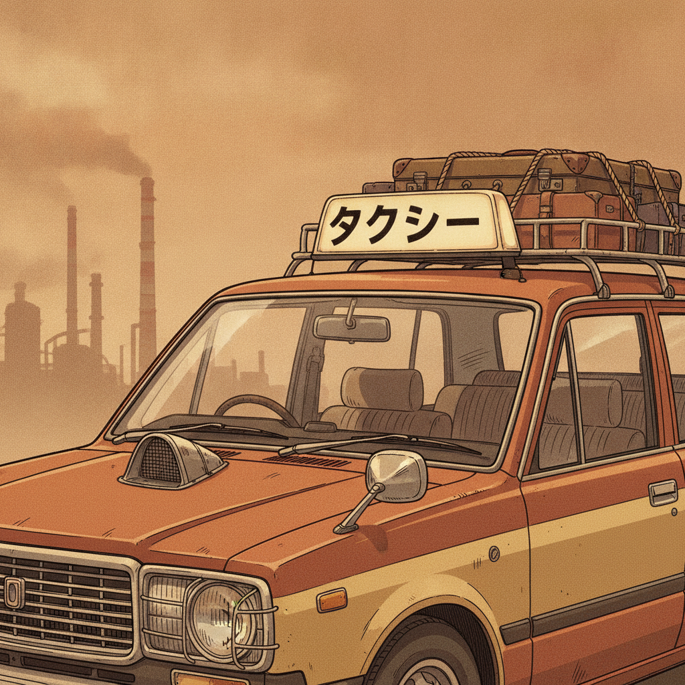
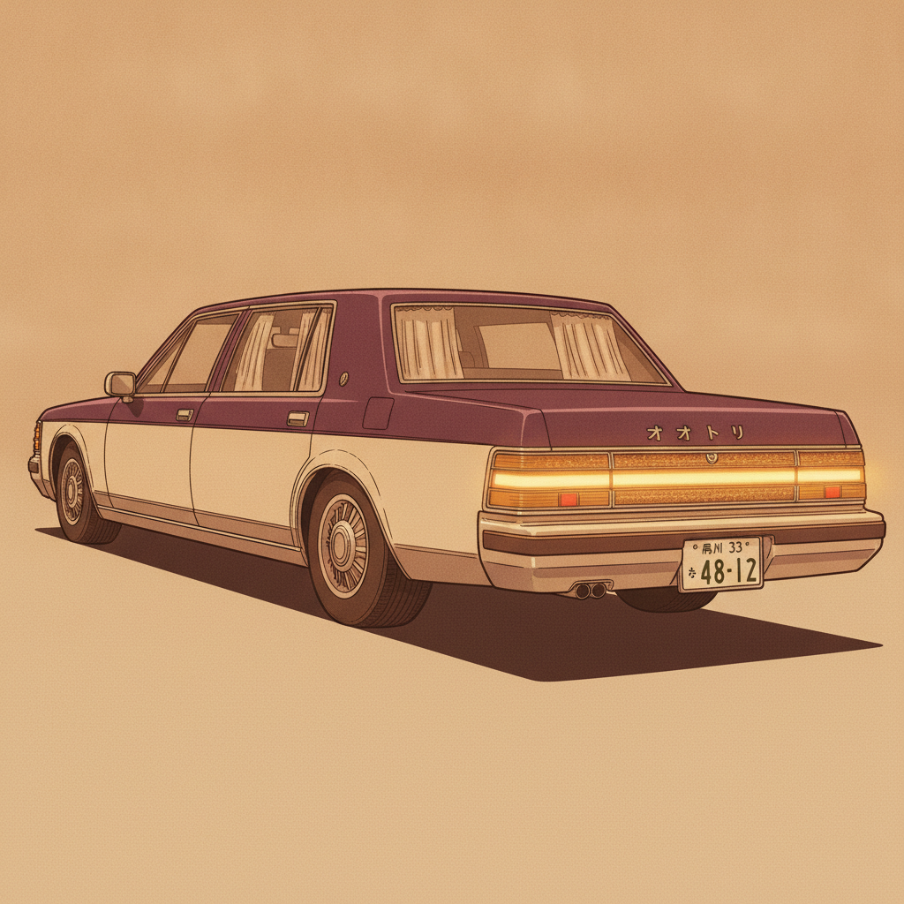
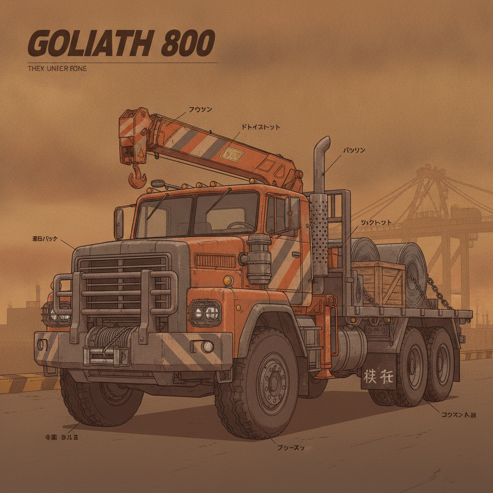
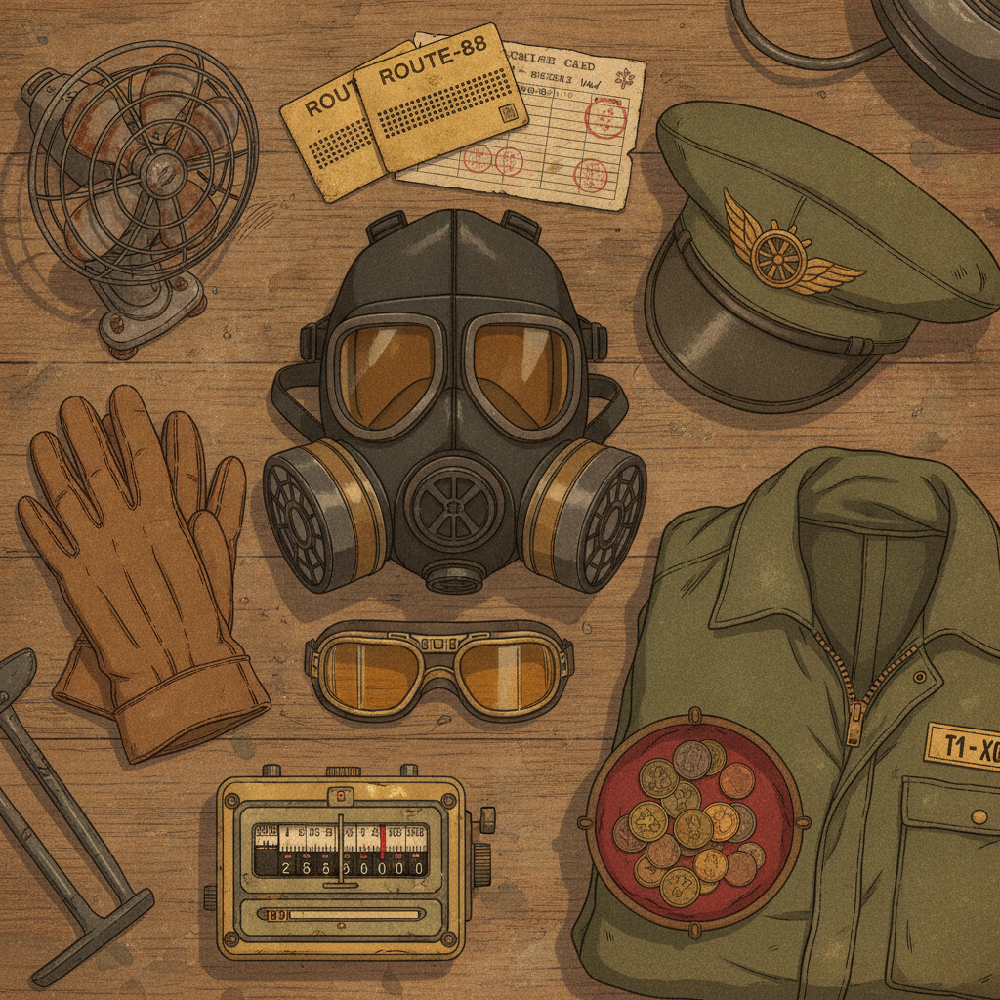
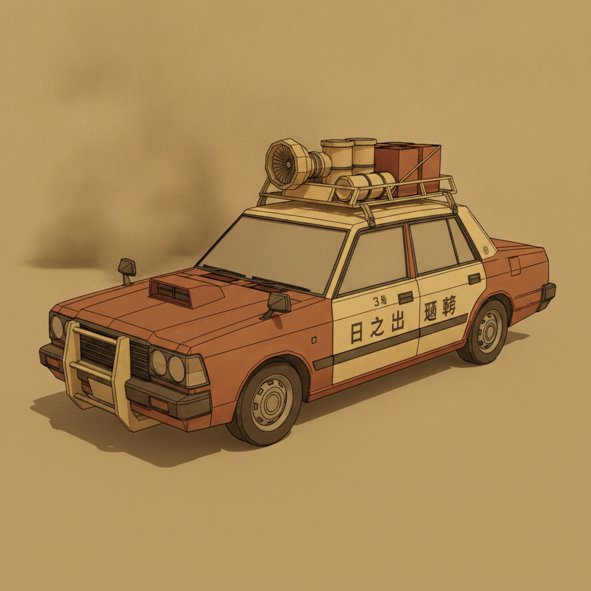
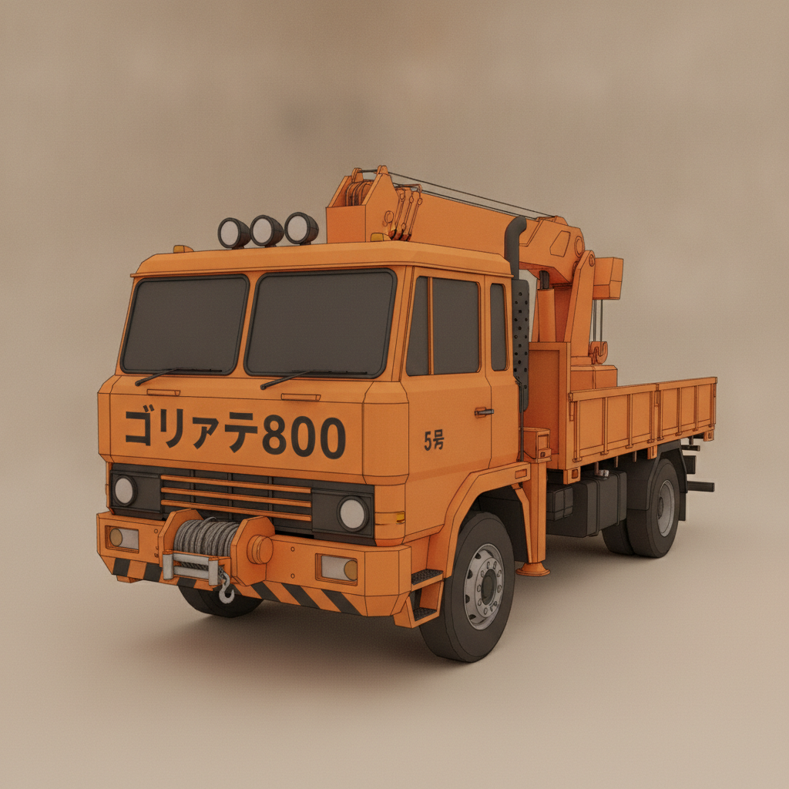
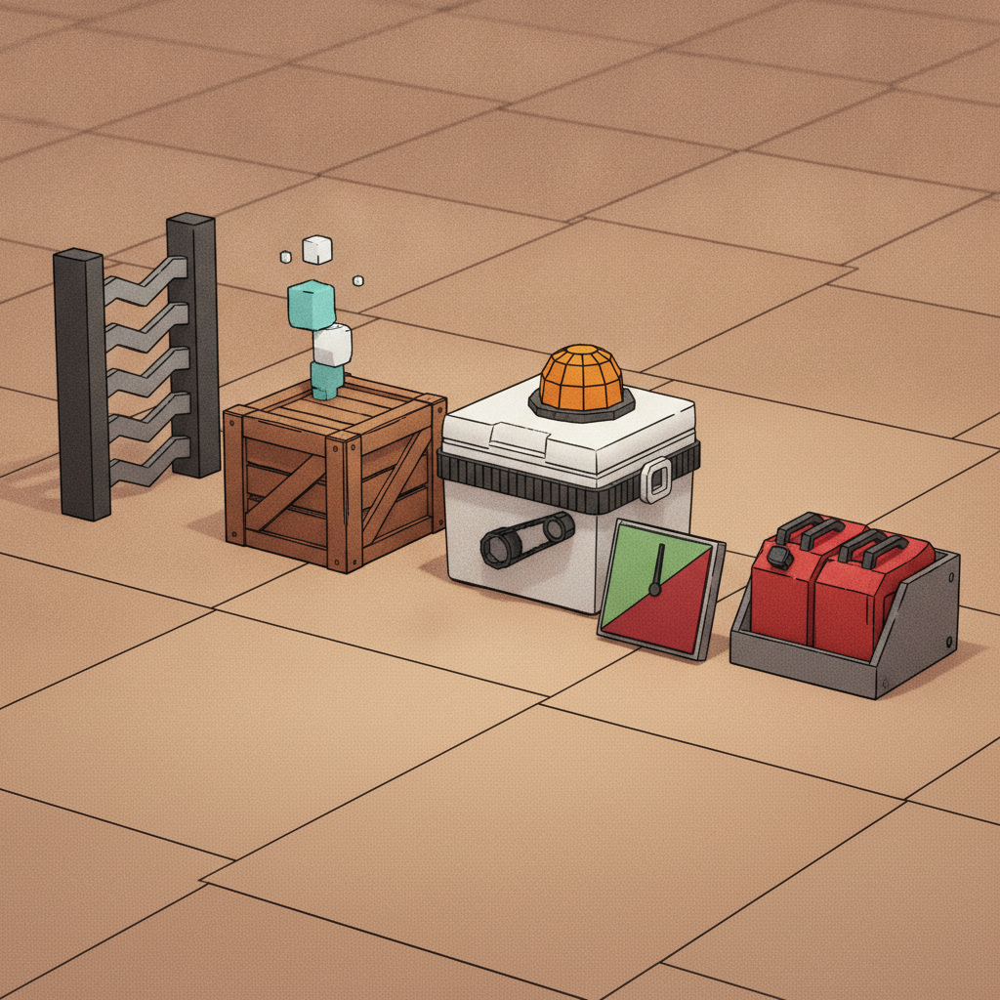

# FLEET & GEAR
### KUROGANE BAY Art Book — Chapter: the vehicles, the upgrades, the cargo, the kit

*Status: draft for bible approval. Canon sources: `gig-city-world-bible.md` §7/§9/§12, `gig-city-retrofutur-identity.md` §1/§4/§8, `showa-dust-extrapolation.md` §5.2/§5.8. Research: 3 Gemini consult rounds (upgrade-tier legibility; cargo telegraphing; low-poly production translation) — digested below, not quoted.*

**Mock layers:** every mock in this chapter carries a layer tag. **[REFERENCE]** = aspirational, painterly, art-directed — the dream. **[IMPLEMENTATION]** = what the final 3D actually looks like under our real technology: Godot low-poly geometry, the AnimeLook shader module (flat color fields, ink outlines, 2-band cel shading, washed-out texture noise), traffic cars ~2k tris and hero cars still low-poly, fixed lighting, upgrade tiers that must read at 50 m in dust. The de-risk question for every IMPLEMENTATION mock: does the visual progression survive low-poly, or only the reference promise?

**Design laws governing this chapter:**
- All vehicles are *analog machines*: carburetors tuned by ear, vacuum tubes, stamped steel, bakelite, rubber hoses with worm-gear clamps. No digital-era form factors (§15 tech ceiling).
- Comedy emerges from systems (unsecured-cargo physics, passenger state machines) — no written jokes, no gag dialogue, anywhere in this chapter. Cargo behaviors are described as physical systems only.
- Original designs, no real-car copies. The greenhouse (A/B/C-pillar profile) and wheel centerlines of each chassis are never hidden by upgrades — player ownership must survive all 5 tiers.
- Every face is masked; every cab carries dust protection. The cab is sovereign ground: the wheelman never leaves the wheel.

---

**2026-10-06 scope proposal:** the six chassis and five visual upgrade tiers below are the long-term art vocabulary, not the first playable economy's shopping list. Start with the existing vehicle and two distinct load/module configurations; add a second chassis only after route and handling tests show a useful niche. All unlock/stat numbers in the historical class descriptions are tuning proposals. [Research and phase gates](../design-review.md) govern scope; no existing Forge vehicle work is canceled.

## A. THE 6 VEHICLE CLASSES

### A1. Hinode Carrier — the starter beater cab

**[REFERENCE]** 
*[REFERENCE] The Hinode Carrier: boxy '70s notchback, rooftop VACANT flag, fender bullet mirrors, cyclone intake on the hood, spare filter canisters on the roof rack.*

**Silhouette:** Upright, honest, boxy '70s notchback — a tall greenhouse, flat deck lid, nearly vertical windshield. The proportions say "fleet issue" before the paint does. Nothing on this car is trying to look fast.

**Signature details:** Rooftop VACANT flag on a brass stalk, lit by a small incandescent bulb (the fleet-cab identity marker — see retrofur §1). Fender-mounted chrome bullet mirrors on thin stalks. Mechanical split-drum taximeter on the dash, flipping physical brass plates. White lace seat covers over cracked tobacco-brown vinyl. Pneumatic-lever rear door that snaps open with a hiss. Grille badge: a rising-sun roundel, fictional marque.

**Dust-era modifications:** Conical cyclone filter intake on the hood (a miniature cement mixer — the bus-hauler lineage from §5.2, shrunk to cab scale). Round headlights caged behind wire guards. Roof rack carrying spare filter canisters like ammunition. Dust caked thick on every horizontal surface; two-tone paint split at the body-side rub strip (faded mustard cream over rust-brown primer).

**Unlocks:** Cab fares, point-to-point express gigs. The bread-and-butter machine; it fits everywhere and impresses no one.

**Fantasy:** *The first cab you're proud of.* Clients tip the driver who keeps a beater this honest — and the Union notices drivers who start here.

### A2. Tatsumi Hauler — the cargo van

**Silhouette:** Cab-over flat-nose box — the engine sits under the driver's seat, so the nose is a vertical wall with two round eyes. Tall, rectangular, unapologetic. The roof is a working surface, not styling.

**Signature details:** Brass pneumatic courier cylinders standing upright in leather holsters along the flank (the tube-city's network, carried on the body). Split tailgate: the top half lifts, the bottom half folds down as a loading step. Enamel route plate instead of a destination blind — routes don't change in the dust. Oversized JIS hex bolts on every panel; ribbed vinyl floor.

**Dust-era modifications:** Twin cyclone intakes on the flanks, caged lamps, welded rebar roof-basket (the §5.8 handcart descendant: everything lashed by hand, with rope). Spare filter canisters in a side pannier. Mud flaps with white stenciled kanji.

**Unlocks:** Multi-drop milk runs (3–6 drops), fragile egg-runs (interior rack volume), heavy haul (subcontract basis), hot contraband (small parcels), perishable wholesale squeezes.

**Fantasy:** *A warehouse with a license plate.* When the dispatcher says "bring the big one," this is the big one.

### A3. Ohtori Sovereign — the luxury sedan

**[REFERENCE]** 
*[REFERENCE] The Ohtori Sovereign: stretched brutalist barge, vacuum-tube taillight bar, lace curtains, sealed formal livery.*

**Silhouette:** A stretched brutalist barge — long flat hood, upright formal greenhouse, and a trunk that reads like a bank vault. The wheelbase is the status; the car announces arrivals before the driver does.

**Signature details:** Full-width vacuum-tube taillight bar, glowing warm amber (filament emission — emissive-restraint compliant). Lace curtains on the rear windows. Upright formal chrome grille with vertical bars. Chrome trim you could shave in. Deep-pile carpet, burled-bakelite dash, a brass dashboard plaque engraved with the owner's name. Hand-crank windows, because power windows are for people who don't employ drivers.

**Dust-era modifications:** Sealed, gasketed dust-proof body panels (rubber bead visible along every shut line). Caged headlights. The vacuum-tube bar is recessed behind a washable lens. Formal two-tone — deep imperial purple over cream — reserved by law of taste for Upper City service (imperial purple is an Upper-City-only accent).

**Unlocks:** VIP chauffeur gigs, corporate escort, prestige fares. **Appeal-gated:** owning a car at Appeal ≥ 70 adds ~20% more personal-gig offers — *the car clients check before they check the driver.*

**Fantasy:** *Silence has a chassis number.* Passengers don't look at the driver; they look at what they're sitting in, and decide what secrets are safe in it.

### A4. Raiden Fastback — the tuner/muscle car

**Silhouette:** A wedge — low nose, rising beltline, kammback flat-cut tail. The hood carries a rectangular cutout through which the carburetors breathe: twin velocity stacks standing proud of the bodywork like organ pipes. Turbine wheels. The stance says "someone else's fuel."

**Signature details:** Exposed carburetors through the hood cutout (tuned by ear at Kotobuki). Turbine wheels with polished lips. Cockpit-crown whip antennae with a union pennant. Aftermarket brass tachometer the size of a dinner plate, bolted to the column. Driver's door carries the Iron Wheel Union roundel — this is the union's car.

**Dust-era modifications:** Exposed pod filter on the velocity stacks (changed between runs). Altitude compensator plumbed into the carb linkage (a Lower tune runs rich and smoky upstairs without it — and smoke attracts corporate police). Caged headlights, per law.

**Unlocks:** Hot contraband gigs, underground outrun events, checkpoint rallies, pink-slip sprints.

**Fantasy:** *It runs on siphoned Sol-88 and your confidence.* The fastest way to learn that gray fuel fouls vacuum-tube electronics is to feel it foul yours mid-pursuit.

### A5. Goliath 800 — the heavy flatbed rig

**[REFERENCE]** 
*[REFERENCE] The Goliath 800: twin-steer tractor, knuckle-boom crane, winch bumper, chained flatbed load, annotated like a workshop manual.*

**Silhouette:** Twin-steer tractor — two front steering axles — pulling a long riveted flatbed. The cab is a riveted steel box with a split windshield; the roof carries marker lamps on a light bar. Behind the cab, a knuckle-boom crane folded like a sleeping arm. Everything on this vehicle is load-rated and stenciled as such.

**Signature details:** Knuckle-boom crane with a hook block and chain sling. Winch bumper with a coiled steel cable and fairlead rollers. Flatbed with stake pockets, rub rails, and a headache rack behind the cab. Air-horn trumpets on the cab roof (audible through dust). Hazard-orange and soot-gray paint with chevron panels — the Tonnage Priority rule (§6) made livery: *this vehicle yields to nothing.*

**Dust-era modifications:** Dual cyclone intakes on both flanks. Perforated heat shield on the exhaust stack with a rain flap. Sealed bearing caps on all axles. The flatbed's tie-down rails are doubled — cargo here is chained, never roped.

**Unlocks:** Oversized freight, heavy haul / flatbed repo gigs, syndicate heavy work (crane-lift extractions, dock salvage), panel-field service runs.

**Fantasy:** *The street yields to you.* Trams yield to nothing; zaibatsu haulers yield only to rail; everything else yields to the Goliath. Traffic planning becomes somebody else's problem.

### A6. Mirage Zero — the exotic wedge

**Silhouette:** A doorstop — a pure show-car wedge with a knife-edge nose, a wraparound glasshouse, and a louvered engine deck venting heat through horizontal slats. The pop-up headlight brow gives it a heavy-lidded stare. This is Showa show-car fantasy, not a hypercar.

**Signature details:** Pop-up headlight brow (mechanical linkage, hand-crank backup). Louvered engine deck. Flush door handles that pop on a thumb-lever. Turbine-style wheels, polished. The paint is the feature: deep candy lacquer over metalflake, hand-rubbed — and dust sticks to it like guilt, which is why owners pay for rinses.

**Dust-era modifications:** Sealed underbody pan (the wedge can't afford dust in the intake tract). Louvers carry mesh screens against grit. The pop-ups are caged when raised. Owners fit the lead smuggler trunk as a matter of course — prestige cargo deserves prestige concealment.

**Unlocks:** Top-tier syndicate gigs, prestige fares, elevator queue-jump contracts (the car is the bribe), Upper City personal deliveries.

**Fantasy:** *A rumor with headlights.* When a Mirage Zero idles at a Chidori curb, the whole strip recalculates who matters.

---

## B. UPGRADE PATHS — what each tier LOOKS like

### B0. The legibility doctrine (from Gemini design consult, canon-filtered)

Every stat owns a **zone** and a **shape language** on the car, so tiers never read as each other:

| Stat | Zone | Shape language |
|---|---|---|
| **Speed** | Hood & rear exit | *Directional, swept* — acute triangles pointing backward: ram-air scoops, dual snorkel intakes, high-angled exhaust stacks |
| **Cargo** | Roof & trunk cavity | *Volumetric, boxy* — upward-expanding cubes: rebar roof baskets, stepped can racks, bulging hydraulic trunk lids |
| **Health** | Perimeter & wheel wells | *Massive, heavy* — chamfered trapezoids, continuous horizontal bands: push bars, mesh window grilles, bolt-on skid plates |
| **Appeal** | Cabin crown & embellishments | *Linear, kinetic* — radiating vertical accents: chrome stacks, whip antennae, amber fog-lamp arrays, metallic sunstrips |

The 5-tier growth arc runs **scrap → fabricated → commercial → specialist → prototype**, and it scales the *chunk*, not the count: one massive structural plate on four comic-book rivets, never twenty small bolts. Tier breaks on the silhouette run roughly 5% → 10% → 20% → 35% → a full contour change — but the **greenhouse and wheel centerlines are never covered**. In the dust, detail dies at 50 meters; contour survives. So every tier's outer boundary carries the **heaviest ink line weight**, and high-tier hardware is painted in **contrasting values** (zinc-chromate yellow, brushed aluminum, rust-red anti-fouling) against the car's matte base paint.

Economy (bible §9): a minor upgrade ≈ 3–4 gigs of earnings; a full vehicle tier ≈ 30–40 gigs + a milestone gate (the scripted exam mission).

### B1. SPEED — the car learns to breathe and exhale

- **T1 (Scrap):** Re-jetted carb, primer-gray hood scoop the size of a lunchbox, hose-clamped to the air cleaner. One exhaust tip swapped for a larger-bore pipe. Reads as: someone opened the hood with intent.
- **T2 (Fabricated):** A single welded pod filter standing proud through a rough-cut hood hole, edges finished with a rubber gasket. Dual exhaust with high-angled tips. Reads as: the engine now breathes through its own hardware.
- **T3 (Commercial):** Ram-air hood scoop with a proper stamped flange; dual snorkel intakes flanking the windshield; an external oil cooler hanging off the front fascia with braided lines. Reads as: cooling and induction are now *systems*.
- **T4 (Specialist):** Hood cutout enlarged and framed in a welded steel surround; twin velocity stacks with rain shields; a wraparound exhaust manifold heat-shield in brushed aluminum. Reads as: the engine is no longer under the hood — the hood is around the engine.
- **T5 (Prototype):** A full blower scoop cutting the windshield sightline at the base, spring-loaded radiator louvers that visibly snap open under load, exhaust stacks in polished brass. Reads as: industrial prototype. The silhouette breaks clean — this is a different animal wearing the same greenhouse.

### B2. CARGO — the car grows rooms

- **T1 (Scrap):** A ratcheting strap set and a plywood trunk divider. Reads as: cargo *could* go here now.
- **T2 (Fabricated):** Welded rebar roof-basket, four anchor points with eye bolts. Reads as: the roof is load-bearing.
- **T3 (Commercial):** Full roof rack with side rails, stepped jerry-can rack on the tailgate, hydraulic trunk-lid struts (the lid bulges slightly — it has *opinions* now). Reads as: the car carries inventory.
- **T4 (Specialist):** Cantilevered rear deck extending past the bumper on steel brackets; chain tie-down rails; a lockable side pannier for courier cylinders. Reads as: the car is a delivery vehicle wearing a cab's clothes.
- **T5 (Prototype):** A full-length baffled drop-tank strapped across the roof deck — *one massive vessel instead of five small cans* — plus a tailgate crane-arm for loading heavy items. Reads as: mobile depot.

### B3. HEALTH — the car puts on armor

- **T1 (Scrap):** Bolt-on skid plate under the sump, four comic-book rivets. Primer-gray patch panels. Reads as: it has been hurt before.
- **T2 (Fabricated):** Welded tubular push-bar on the nose; steel-mesh grille over the windshield (three chunky bars — negative-space punch-outs that read at 50 m). Reads as: it expects to be hurt again.
- **T3 (Commercial):** Full perimeter rub rail in channel steel; bolt-on wheel-well armor hugging the tires; reinforced door beams (visible as external seam plates). Reads as: a battering ram with paperwork.
- **T4 (Specialist):** Exocage tubes framing the cabin, tied into the bumpers; double-skinned sills; a belly pan in checker plate. Reads as: the greenhouse is now *inside* the armor.
- **T5 (Prototype):** Full dust-armor package (see B5): gasketed panels, sealed bearing caps, armored fuel cell, mesh screens over every intake. The car reads as a single sealed ingot that happens to have windows.

### B4. APPEAL — the car learns manners

- **T1 (Scrap):** A wash, a wax, and the lace seat covers replaced. Incandescent roof-sign bulb swapped for a fresh one. Reads as: somebody cares.
- **T2 (Fabricated):** Chrome trim straightened and re-mounted; whip antenna with a union pennant; amber fog lamps on a bolt-on bar. Reads as: cared-for, with opinions.
- **T3 (Commercial):** Two-tone respray with a hard rub-strip split line; polished turbine-look wheel covers; metallic sunstrip on the windshield. Reads as: a professional's car.
- **T4 (Specialist):** Full chrome stack set, lace curtains (sedan classes), burled-bakelite dash trim, brass plaque with the driver's name. Reads as: the car clients check before they check the driver.
- **T5 (Prototype):** Show-car finish — candy lacquer, hand-rubbed, vacuum-tube taillight bar (Sovereign) or full brightwork package; the dust *slides off* for exactly one gig, and that's the point. Reads as: arrival.

### B5. DUST-ERA MODULES — the tax you can see

These ride alongside the four stats — the dust is a tax, and these are the receipts, bolted on:

- **Particulate filter tiers** (longer boost before saturation): T1 — a tin canister with a paper element hose-clamped to the intake. T2 — twin canisters in a side pannier. T3 — a cyclone pre-separator cone (the miniature cement mixer) feeding the canister. T4 — dual cyclones, one per flank, with an oil-bath secondary. T5 — a large conical separator with brass plumbing and a dash-mounted saturation gauge (analog needle, red zone). *The filters grow; the plumbing gets brassier.*
- **Altitude compensator** (carb auto-trims between strata): T1 — a dash knob on a Bowden cable the driver trims by hand (and by ear). T2 — a brass diaphragm valve plumbed into the carb linkage, self-trimming. T3 — linked twin-carb compensation with a dash repeater gauge. Without it, a Lower tune runs rich and smoky upstairs — and smoke attracts corporate police. *The valve gets bigger; the knob disappears.*
- **Lead-sealed smuggler trunk** (decon-proof; +mass; changes drift physics): the trunk lid gains vault-grade hinges and a visible lead-gray seam at every shut line; "SEALED" stenciled in whitewash. The rear suspension visibly sits lower — the mass is honest. At the elevator inspection gantry, sealed cargo reads clean; the car reads *guilty* to anyone who knows what a lead seam looks like. *The trunk gets heavier-looking, and the stance tells the truth.*
- **Dust armor** (sealed bearings, gasketed panels — less degradation in Shinkai): rubber bead along every panel gap; sealed bearing caps on the axles; mesh screens over the grille and intakes; checker-plate belly pan; extended mud flaps with stenciled kanji. *The armor accumulates: beads, caps, screens, plates — each tier adds one more layer of sealed intent.*

---

### B6. HOME GARAGE — money, materials and a reason to return

**Craig's direction:** resources brought home fund improvements, better handling/speed/capacity, later vehicles and parking. **Recommended rules:** one protected home bay, limited owned-stock storage, a repair bench and a manifest shelf. Storage transfers are atomic; only player-owned goods and explicitly awarded legal salvage enter upgrade recipes. Customer freight stays sealed even when parked overnight.

Start with two recognizable material inputs — scrap and repair parts — plus cash. Every recipe shows exact inputs and benefit; shops offer a cash substitute at posted prices so a rare drop never gates basic progress. A proposed rack upgrade might cost 2 scrap + 1 parts crate + labor cash; selling those materials instead is an immediate liquidity choice. Avoid random component tiers and hidden recipes. Reconcile crafting yields and buyback values against the economy ledger before tuning rewards.

| Step | What changes at home | Tradeoff / scope gate |
|---|---|---|
| Starter bench and storage | Repair, fuel/filters, secured small cargo, one useful rack or handling upgrade | Ordinary work remains profitable with the starter. Cash spent upgrading cannot also cover the next fuel bill; display a working-reserve estimate. |
| Specialist module and second vehicle | Choose cargo rack, protective lining, cold box, or responsive light chassis | Modules consume mass/space and have operating costs. Faster handling stays useful in alleys; a larger van consolidates bulk but loses access/turning/braking flexibility. Cooling trades capacity and fuel for shelf life. |
| Rented parking bays | Keep a second configuration ready; later store more owned stock | Rent is quoted per shift, not offline real time. Missed rent suspends extra-bay use under a disclosed grace rule; stored goods and the starter are not silently deleted. No hidden infinite storage. |
| Abstract hired dispatch (later) | Assign one bounded route, driver, vehicle and load with a ledger | Pay wages, upkeep, fuel and parking from real proceeds. Never earn while paused; no goods teleporting between two simultaneous jobs. This is not yet a physical convoy. |
| Following trucks/fleet (last) | A visible convoy with grouping, separation and stuck recovery | Requires dedicated navigation, traffic, stop/parking and save tests. Do not make follower AI a dependency for the first garage upgrade. |

Dust filters slow wear rather than ending service forever; propose diminishing returns and a minimum service cost, subject to balance review. Armor reduces specific impact loss but adds mass; racks do not increase engine output. Handling upgrades improve a declared response/braking band, not immunity to loaded inertia. Preserve the small-car niche. T1–T5 silhouette studies remain available for later art work; fewer mechanical levels can ship first.

The garage should show the operation growing through existing props: one bench, labeled parts shelves, a painted bay number and later a rental placard. The player returns to see the resources they chose to keep. New garage art is a later request; this documentation update commissions none.

## C. CARGO ITEMS — the physical payload catalog

**The telegraphing doctrine** (from Gemini design consult, canon-filtered): every item's *form* tells you its *handling rules* before you touch the throttle. Ground 70% of each item in period-accurate 1970s utility (corrugated tin, Showa typography, hemp knots, oxidized steel); the remaining 30% is the *game tell*, scaled up — one oversized analog gauge, one violently swinging sight-glass, one absurdly heavy weld bracket. Exactly **one** animated tell per item. Never a plain wooden crate: perishable boxes are slatted, heavy boxes get cast-steel corner boots, fragile boxes hang inside gimbal rings.

**Lashing grammar** (trunk economy — everything external, everything visible):
- **Hemp rope** — elastic, honest. Knot count is the tell: dense figure-eight knots mean *this load wobbles*; rope stretches under braking and the load shifts — you feel it through the wheel.
- **Steel chain** — zero stretch, for dense cargo only. Chains spark against sheet metal under load — the audio-visual warning that an anchor point is about to rip out.
- **Canvas tarp** — milspec olive, ratchet-cinched: weatherproof, suppresses shifting. A loose, fluttering tarp costs you top speed in drag.
- **Leather straps + brass buckles** — paper cargo. Precise, quiet, expensive-looking. If it's buckled in brass, it cannot get wet, full stop.

**Mechanical staging (proposal):** ordinary robust crates are the baseline; use discrete load slots, a mass value and a simple condition meter first. Add one specialist modifier at a time. The C1–C8 props remain authored visual targets, not eight required simulations. Independent rigid bodies, slosh/detonation, RPM medical cooling and pneumatic interception are later feasibility work. Keep deadline pressure optional on ordinary freight. Passengers consume seats and use comfort/appointment constraints; contraband applies an inspection tag. The same load ledger must support all of them.

### C1. Fragile egg-run (G-force & bump thresholds)

| Item | Visual | Handling telegraph |
|---|---|---|
| **Wedding cake** | Gloss-white box, cherry-red cross-braces, carried in a tall skeletal wire cage with external coil dampener springs; string handles | Needle-thin, tall silhouette; the springs visibly bottom out before the cake does — *the cage is the gauge* |
| **Stemware crate** | Slatted crate stenciled "GLASS — THIS SIDE UP" in Showa type, suspended inside outer gimbal rings on the roof rack | Gimbal rings swing with the car's roll; when they hit their stops, you're one pothole from shards |
| **Nitro cells** | Ribbed steel pressure cylinders with thick rubber bumper rings; a high-contrast analog needle gauge with a red kill zone, mounted valve-side toward the driver | Hazard-yellow/black diagonal bands; the needle is the item's heartbeat — and its threat |

### C2. Perishable timer (cold-chain countdowns)

| Item | Visual | Handling telegraph |
|---|---|---|
| **Bluefin tuna** | Wooden fish box packed with cracked ice, slatted sides, mint-green stencil; a sight-glass tube on the flank shows meltwater level | Cold vapor drips backward in the slipstream — *the vapor trail is the timer*; when it stops, the fish is dying and so is your payout |
| **Live octopus** | Sealed round tank with a gasketed lid, water sloshing visible through a thick sight-glass band; canvas dust-cover lashed over the top | The sloshing waterline is the momentum tell — brake hard and the whole tank surges; octopus arms visible through the glass when it settles |

### C3. Paper chase (cannot get wet, cannot be seen)

| Item | Visual | Handling telegraph |
|---|---|---|
| **Bond certificates** | Flat leather document case, brass buckles, wax seal; strapped inside the cabin, never on the roof | No external tell at all — *the absence of cargo is the tell*; heat level rises silently while the case sits on the back seat |
| **Blackmail notebook** | Small oilcloth-wrapped parcel, string-tied, tucked in a courier cylinder | The cylinder rides in the brass flank holsters — visible to anyone who knows what a courier cylinder means |

### C4. Tube-intercept (pneumatic network)

| Item | Visual | Handling telegraph |
|---|---|---|
| **Pneumatic capsule** | Brass cylinder, knurled end-caps, paper dispatch chit wired to the side | Snatched mid-transit or delivered sealed — *an unbroken wax seal pays double*; the chit flutters in the slipstream as a speed tell |

### C5. Cryo-timer (RPM-charged)

| Item | Visual | Handling telegraph |
|---|---|---|
| **Organ cooler** | White medical chest with a red-cross stencil, bolted to the trunk floor; an exposed fan belt drives a small alternator with a spinning amber charge lamp | The charge lamp is the whole gig: it only stays lit above 3,500 RPM — *the lamp dying is the patient dying*; the belt squeal under load is the audio tell |

### C6. G-force threshold (velvet hands)

| Item | Visual | Handling telegraph |
|---|---|---|
| **Vinyl acetates** | Flat square crate in a domed acrylic cloche, suspended on coiled dampener springs inside an outer frame; "0.4 G" stenciled on the side | One oversized analog G-meter bolted to the crate's face, needle in green — *the needle is the contract*; the springs compress visibly under lateral load |

### C7. Volatile mass (slosh + detonation)

| Item | Visual | Handling telegraph |
|---|---|---|
| **Fuel canisters** | Red steel jerrycans, chained upright in a welded rack with padlocks; each carries an analog pressure needle with a red kill zone | Chains — never rope — because this cargo does not forgive; impact spikes swing the needles, and the rack's chain tension *sings* under hard cornering |

### C8. Unsecured-cargo comedy (rigid-body mass, physics-driven)

| Item | Visual | Handling telegraph |
|---|---|---|
| **Safe** | Cast-iron dark slate, ultra-flat profile hugging the roofline, cast-steel corner boots, chained down; visibly drops the rear suspension | The car's stance *is* the warning — low rear, bent rack clamps; brake hard and the mass keeps going (this is the safe-through-the-windshield system, stated as physics) |
| **Chicken crate** | Slatted wood crate, wire-mesh sides, broken porous silhouette — feathers and shifting mass visible through the slats | Porous silhouette with protruding geometry; the crate's center of mass visibly shifts in corners; if the lashing fails, feathers become a cockpit-visibility system event |

---

## D. DRIVER GEAR — the wheelman's kit

**[REFERENCE]** 
*[REFERENCE] The wheelman's kit: respirator, amber goggles, union cap, ROUTE-88 punch cards, stamped union card, pigskin glove, brass-zippered coverall, coin tray, split-drum taximeter, dash fan.*

The driver is never modeled unmasked. The kit *is* the character — silhouette + mask + props, per the character law.

### D1. The worn kit

- **Union driver cap** — peaked, olive drab, with the Iron Wheel Union roundel embroidered in brass thread. The brim is sweat-stained in the exact shape of a forehead. Worn *over* the dust hood, never instead of it.
- **Respirator + amber goggles** — full-face industrial respirator with round filter canisters; amber-tinted goggles worn over or under, driver's choice. Behind the respirator, only the eyes show — and in the game's framing, the eyes are usually in shadow anyway.
- **Pigskin gloves** — fingerless or full, oil-darkened at the palms. The steering wheel wears through gloves the way roads wear through tires.
- **Brass-zippered coverall** — olive or tobacco-brown, brass zips at the chest and cuffs, a hundred pockets (Mariko Katsu's influence on garage fashion is citywide). Name tape on the breast: surname only, chain-stitched.
- **The paper union card** — reputation is *stamped*, not XP. A folded paper card in a waxed-canvas sleeve; district stamps in red ink, tallies in pencil, suspensions in black. Upgraded at chop shops, presented at elevator terminals and faction gates. Lose it and you're nobody with a car.

### D2. The working tools

- **ROUTE-88 punch cards** — brass-edged manifest cards for each accepted gig. Fed into the dash slot with the *CHUNK-CHUNK*; the CRT displays stops, payload, the agreed window and settlement, never a live route trace. The briefing, paper map, road signs and landmark memory guide the driver. Card-wallet thickness remains a veteran's visual signature; cards are not a mandatory paid consumable in the proposed slice.
- **Coin tray** — red felt, dash-mounted: coins, delivery chits, cigarette butts, toll tokens. The tray's contents are the driver's autobiography.
- **Split-drum taximeter** — mechanical, brass plates flipping with each fare increment. It is also the driver's lie detector: the drums don't stop for anyone.
- **Dash-mounted oscillating fan** — a 12V exposed-blade metal fan clamped to the A-pillar, sweeping the cabin with dust-scented air. It doesn't cool anything; it *moves* the air, which is the next best thing.

### D3. The cab interior as confessional booth

The *Night on Earth* rule: the cab is the one sealed, private room in a city with no privacy. The dashboard suite — green vector CRT, split-drum taximeter, oscillating fan, coin tray, lace seat covers, the pneumatic door lever — frames every passenger conversation like a confessional screen. Passengers say things in the back of a cab they'd never say anywhere else: the sweating exec's double life, the oyabun's daughter's date, the whistleblower's evidence. The driver hears everything, judges nothing, and the ROUTE-88 keeps the manifest. **The interior is a storytelling machine built from stamped steel and bakelite** — use a few authored introductions and milestone conversations; on ordinary repeat jobs, the *situation* (who's in the back seat, what's in the trunk, how much heat is outside) carries the variation.

---

## E. PRODUCTION TRANSLATION — the implementation layer

*(From the low-poly Gemini tech consult, canon-filtered. The ruling in one line: at 50 m in dust, silhouette-chunk size >>> contrasting paint values >>> cel shadow bands >>> fine detail (dead). Anything smaller than ~0.25 m world-space drops below a pixel on 1080p and is never worth tris.)*

### E1. The low-poly doctrine (applies to all 6 classes + all cargo props)

**Geometry vs. texture ruling:** only *silhouette-breakers* earn geometry. Tier 4–5 speed wings, hood blowers that break the hood plane, exhaust stacks that break the rear contour, push bars projecting past the bumper, external cage loops, and the bounding prism of any roof basket or crate — these are real chunks. Everything else is albedo/material-ID plus a hard ink line in the texture: T1–3 scoops and side vents get a baked fake drop-shadow in the albedo; intercooler mesh is a flat bumper quad with a painted grid; door armor and rivets/welds are coplanar quads or painted into the door texture; chrome brightwork is a material ID with a stepped, stylized specular band; pinstriping is albedo only.

**The 50 m tier signal** runs on the B0 arc unchanged — chunk, not count — but the *carrier* of the signal is paint value, not geometry: a white hood against a dark chassis reads through 50% fog; a red fender on brown washes into grey mush. Every tier's outer boundary keeps the heaviest ink line weight (B0 stands), but the outline pass needs a fog clamp so the ink keeps a 30–40% value floor instead of washing chalky grey.

**Hard production warnings (encoded for modelers):**
- **Inverted-hull black-blobbing:** thin geometry (antennae, cage bars, roll-cage tubes) blows out into swollen black scribbles under the outline pass. Suppress outlines on small props via a vertex-color channel.
- **No alpha-scissor** for wire mesh, chains, or grilles — it stalls mobile tile-based GPUs. 100% opaque geometry only; fake perforations with baked high-contrast line textures.
- **No dial needles at distance** — a moving needle is sub-pixel crawl. Analog gauges become binary: the whole dial face flips color (red/green halves, or solid red + emissive flash on alert).
- **No real lights for prop telegraphs** — a dynamic OmniLight is fill-rate suicide on mobile. Emissive states are driven by instance shader params (e.g. RPM-over-threshold flips the amber lamp's albedo band to emissive), and the lamp is modeled **3× oversized** so it reads at 50 m.

### E2. Hinode Carrier — implementation

**[IMPLEMENTATION]** 
*[IMPLEMENTATION] The Hinode at late tiers, as a Godot low-poly screenshot: faceted mustard/rust body, hood blower chunk, prism push-bar, zinc-yellow door plates with oversized bolt heads, roof-rack basket prism with filter canisters, conical cyclone intake, bullet mirror.*

**What survived:** the whole B0 shape language — the hood blower is a silhouette-breaking chunk (T5 SPEED reads at 50 m), the push-bar is a 3-sided prism past the bumper (T2 HEALTH), the zinc-yellow door plates with four comic-book bolt heads carry T3–T5 HEALTH on paint value, the roof-rack basket is a solid bounding prism (CARGO), the conical cyclone intake reads as one 12-sided cone (dust module). Two-tone split at the rub strip survives as albedo zones.

**What was cut/changed:** T1–T3 SPEED hardware (primer lunchbox scoop, rough-cut pod filter) is albedo + ink line only — honest flag, it is *invisible at gameplay distance* and reads only in garage close-ups; the tier signal there rides on the paint value, not the scoop. The mock collapsed the VACANT flag-on-brass-stalk into a generic roof-sign box — the flag design is NOT cut; the real model restores the brass-stalk flag, it's the fleet identity marker. The mock's diegetic roof sign carried legible micro-text — real build renders the sign as geometry + albedo with NO readable text (sub-pixel crawl rule).

**Honest flag:** the reference promise "T1 reads as someone opened the hood with intent" cannot survive at 50 m in dust. T1–T3 SPEED is a garage-showroom read; on the road, SPEED's signal starts at T4 (contour breaks) plus the contrasting paint values.

### E3. Goliath 800 — implementation

**[IMPLEMENTATION]** 
*[IMPLEMENTATION] The Goliath 800 as a Godot low-poly screenshot: twin-steer tractor (two front axles mandatory — see flags), knuckle-boom crane folded in big rectangular segments, winch drum on the bumper, solid slab-sided basket rails, crate loads in solid stamped-metal bracket straps, hazard-orange/soot-gray value zones, chevron color blocks.*

**What survived:** hazard-orange/soot-gray value zoning, chevron color blocks on the bumper, the winch cable drum as a chunky cylinder, roof marker lamp bar, riveted cab box with split windshield. The flatbed loads read as blocky crates under solid bracket straps — the chained-load look translated.

**What was cut/changed:** chain links → solid stamped-metal bracket straps (chains blob under inverted hull at distance, and the mock's thin slat rails must become a solid slab prism per the no-alpha-scissor rule). Marker and charge lamps oversized 3×. Crane hook-block/chain-sling detail is garage-props only.

**Honest flags (two, both mock drift, both must be fixed in the model):**
1. The mock shows the crane RAISED; the reference design parks it folded "like a sleeping arm." The mock is wrong — the real model folds it.
2. The mock reads as a single front axle; the **twin-steer second axle is the class's signature silhouette** and must be modeled — it's a silhouette-breaker, non-negotiable.

### E4. Cargo-lashing study — implementation

**[IMPLEMENTATION]** 
*[IMPLEMENTATION] The cargo telegraphs as low-poly theater props: wedding-cake box in four thick corner posts with accordion zigzag strips, slatted tuna crate with 2-tone anime vapor puffs, organ cooler with an oversized emissive amber dome lamp and fan belt, half-red/half-green binary dial face, red jerrycans in a solid stamped bracket rack.*

**What survived (the de-risk verdict — all five telegraphs translate):**
- **Wedding cake:** wire cage CUT; four thick corner posts + flat roof cap + accordion zigzag cross-strips replace the coil springs (springs scale on Z in the vertex shader with vehicle vertical velocity). The mock nails this — the cage still reads as "the gauge."
- **Bluefin tuna:** the vapor trail SURVIVES as 4–6 CPUParticles3D billboard quads with an 80s 2-tone puff sprite. Hard limit: keep the count tiny; over-scaling drifts into modern soft-puff territory.
- **Organ cooler:** amber lamp SURVIVES as an 8-tri dome at 3× scale, emissive step driven by an RPM instance shader param — no OmniLight. The belt stays as a simple torus-ish band; the squeal is the audio tell, not geometry.
- **Nitro/fuel dials:** needle CUT; whole-face binary color flip (half-red/half-green dial, solid red + emissive flash on alert). The mock's needle-free dial is the production spec.
- **Gimbal rings:** flat 8–10-sided ribbon hoops (16–20 tris per ring), tilt animated from vehicle roll vectors in a vertex shader — no physics joints.

**What was cut:** helical spring geometry, real wire mesh, analog needle gauges, chain links on the loads, hemp-rope strand geometry (rope is a single extruded spline tube; the *knot count* tell becomes texture bumps at garage distance only).

**Honest flag:** the octopus tank's sloshing sight-glass and the bond certificates' "no external tell" survive only at close range — at 50 m a tank is a sealed round box, full stop. The *momentum* telegraph (sloshing waterline) is a chase-camera/garage read, not a gameplay-distance read. Design accepts this: the tank's visible surge matters when the player is close enough to see it slosh.

### E5. Coverage gaps (not yet translated)

This pass covers the Hinode Carrier, the Goliath 800, and the cargo props. Still owed an IMPLEMENTATION pass: Tatsumi Hauler, Ohtori Sovereign (note: its reference mock had stamped spec text — the impl pass must avoid that), Raiden Fastback, Mirage Zero, and the driver gear flat-lay. The upgrade-tier T1–T5 visual matrix (B1–B4) reads on the Hinode proofs above, but each chassis needs its own impl verification before modeling briefs go out.

---

## OPEN QUESTIONS (pending BIBLE DELTA)

1. **Mirage Zero class gating** — the bible assigns it "top-tier syndicate gigs, prestige fares." Is there a named gig *class* that requires the Mirage specifically (like Ohtori ↔ Appeal ≥ 70 VIP), or is it pure aspiration/prestige with no mechanical gate?
2. **Subcontract/lease visuals** — when a client provides the vehicle for a 50% cut, does the leased vehicle carry visible client livery (syndicate colors, corporate plates)? A visual tell would let players read "this run is borrowed" at a glance.
3. **Lead-trunk vs. inspection triage** — the smuggler trunk's lead seams are visible to anyone who knows what to look for. Does the elevator gantry scanner *gameplay* treat a lead trunk as "reads clean," "reads suspicious," or "reads clean but flags the car for manual inspection"? The visual design hinges on which.
4. **Appeal ≥ 70 on non-Sovereign chassis** — can a fully-appealed Hinode Carrier (T5) clear the VIP gate, or is the Ohtori's *class* the gate regardless of stat? (Bible says "corporate clients refuse a rusted hatchback (Appeal ≥ 70)" — is the number the gate or the class?)
5. **Union card tiers** — how many stamp tiers exist on the paper card, and does the card's visual state (stamps, black marks) gate elevator Express Freight Line access directly, or only faction standing?
6. **Filter economy vs. filter tiers** — particulate filters are both a recurring cost (the Dust Tithe: rinses, replacements) and an upgrade track (B5). Is a T5 filter a *purchase* that ends the tax, or does it just slow the meter? The visual "filters grow" arc implies permanence; the economy implies recurrence.
7. **Punch-card inventory** — are ROUTE-88 cards single-use per gig (a consumable the driver buys in stacks) or reusable blanks re-punched per job? Affects the card-wallet prop and any pre-gig economy.
8. **Goliath vs. Hauler overlap** — the Tatsumi unlocks "heavy haul (subcontract)" and the Goliath unlocks "heavy haul / flatbed repo." Where is the mechanical line: trailer towing only on the Goliath? Crane-lift gigs only on the Goliath? Needs a one-line rule so the two classes don't blur.

---

*End of FLEET & GEAR chapter draft. Mocks — [REFERENCE] layer: `mock-hinode-carrier.png`, `mock-ohtori-sovereign.png`, `mock-goliath-800.png`, `mock-cargo-lashing.png`, `mock-driver-gear.png` (80s-anime cel, verified by eye: warm umber shadows, no neon soup, no unmasked faces, no digital-era form factors). [IMPLEMENTATION] layer: `impl-hinode-carrier.png`, `impl-goliath-800.png`, `impl-cargo-lashing.png` — low-poly 3D game-screenshot read (faceted geometry, ink outlines, cel bands, washed-out texture noise, simple backdrops), each opened and verified: no painterly drift, no text artifacts (one diegetic TAXI roof-sign in the Hinode mock — flagged in E2), no digital-era form factors, no faces. E2–E4 carry the per-vehicle production translation notes with honest flags; E5 lists the chassis still owed an impl pass.*

## Plausibility — what's depicted, why it's that way (2026-10-05)

Per Craig's law: dystopia allowed, unexplained eeriness is a defect, stereotype never. This chapter's images are vehicle/gear studies with no human figures — plausibility here is whether the machines and kit belong to the economy. They do, uniformly. Full text in `~/workspace/game-design/art-book/plausibility.md`.

- **`mock-hinode-carrier.png` / `impl-hinode-carrier.png` — PASS.** The starter cab: two-tone sedan, roof rack with luggage, VACANT sign, hood spotlight, era-correct boxy proportions. *Reflects:* the player's sovereign ground — home, office, armor; the drive-up economy's handshake (VACANT sign); the spotlight is the dust-visibility answer. *Why no driver:* the wheelman is the player — the cab is presented empty like a class-select screen; the luggage rides the rack because the cab carries its life with it.
- **`mock-ohtori-sovereign.png` — PASS.** Executive limousine, armored, studio spec-sheet profile. *Reflects:* the Upper Aerium's answer to the cab — armored because even the rich cross the Trench to reach their elevators. *Why:* machine document; proportions fixed, no scene staged.
- **`mock-goliath-800.png` / `impl-goliath-800.png` — PASS.** Heavy crane-truck, annotated concept sheet and in-engine version. *Reflects:* the heavy-industry end of the fleet — the machine that loads what the haulers carry at Daikoku. *Why:* callouts fix assemblies for the art team; the harbor backdrop is its workplace.
- **`mock-cargo-lashing.png` / `impl-cargo-lashing.png` — PASS.** Roof-rack cargo still life and in-engine prop set: lashed baskets, stenciled crates, canisters, rope knots. *Reflects:* cargo is the game's verb — this is the prop bible for "loaded." *Why:* everything is lashed because the city's roads shake loads apart; mixed cargo because a gig driver takes whatever pays.
- **`mock-driver-gear.png` — PASS.** Flat-lay of the wheelman's kit: respirator, goggles, gloves, peaked cap, fare meter, route punch-cards, fare tokens, fan, tire iron. *Reflects:* the character law made personal — mask and goggles as survival uniform; the meter and punch-cards are the cash/Sol-88 economy in objects. *Why:* the kit IS the portrait — the driver is whoever wears it; the respirator is centered because it's the single most important object in the city.