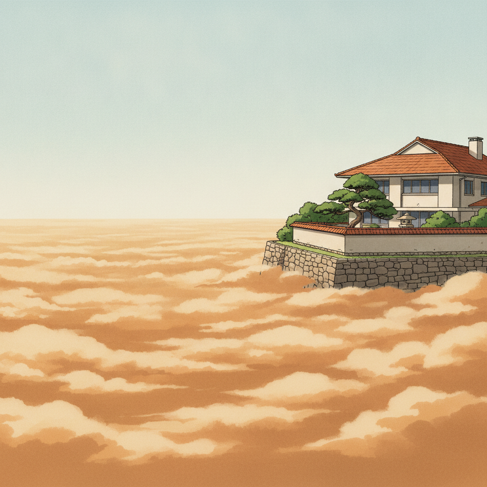
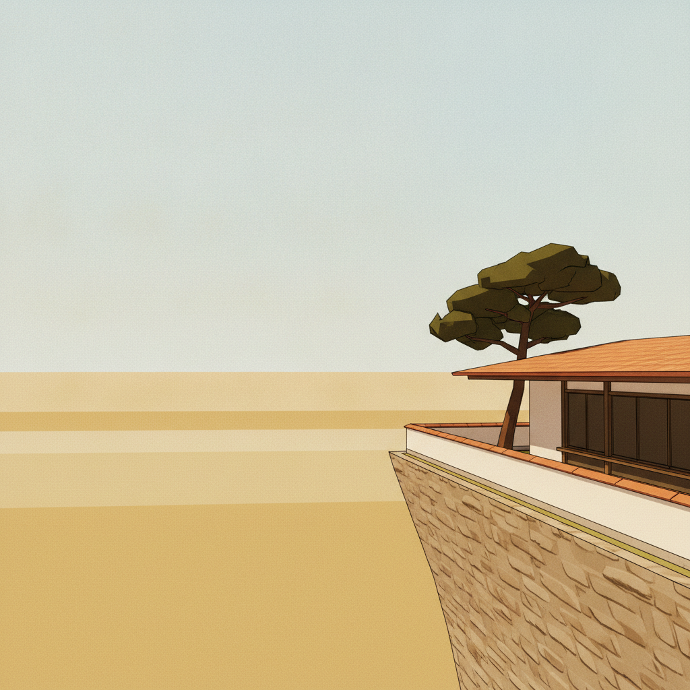
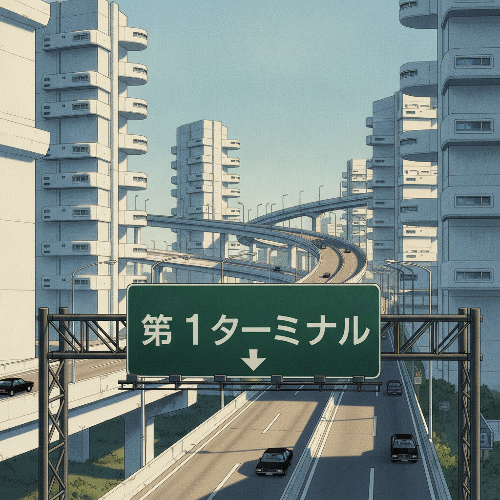
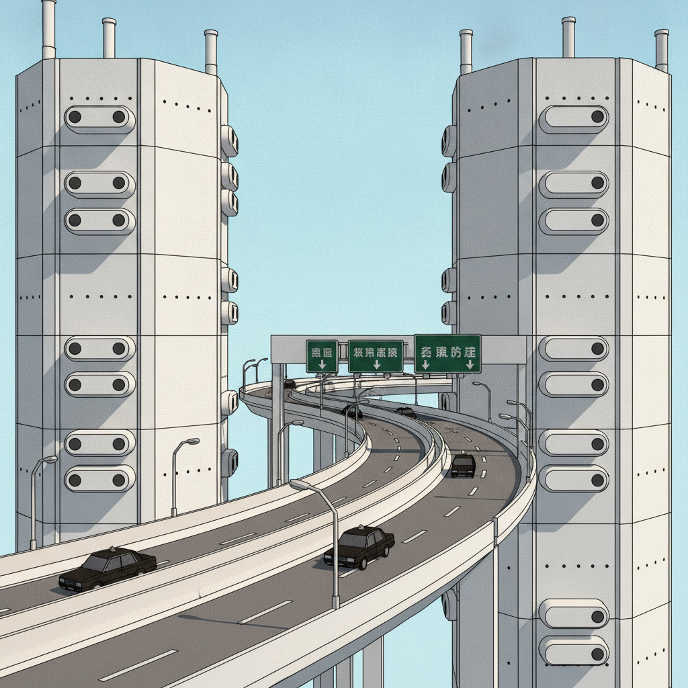
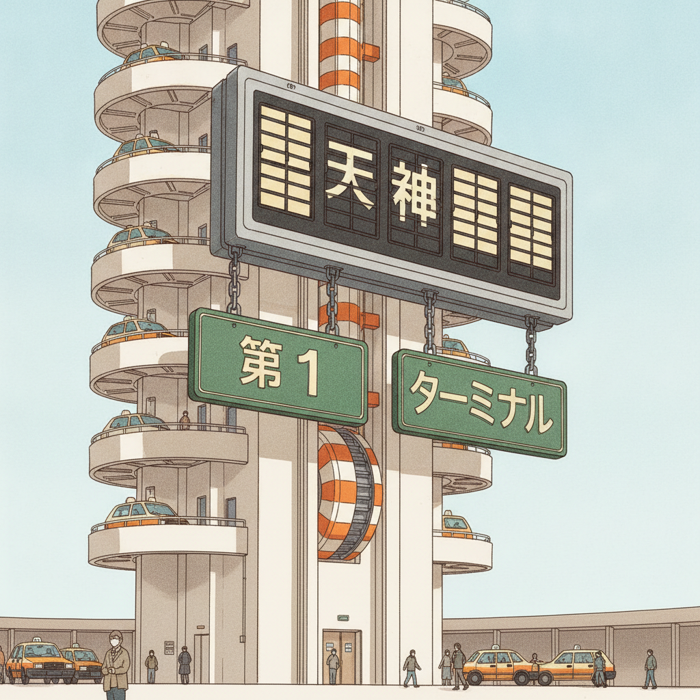
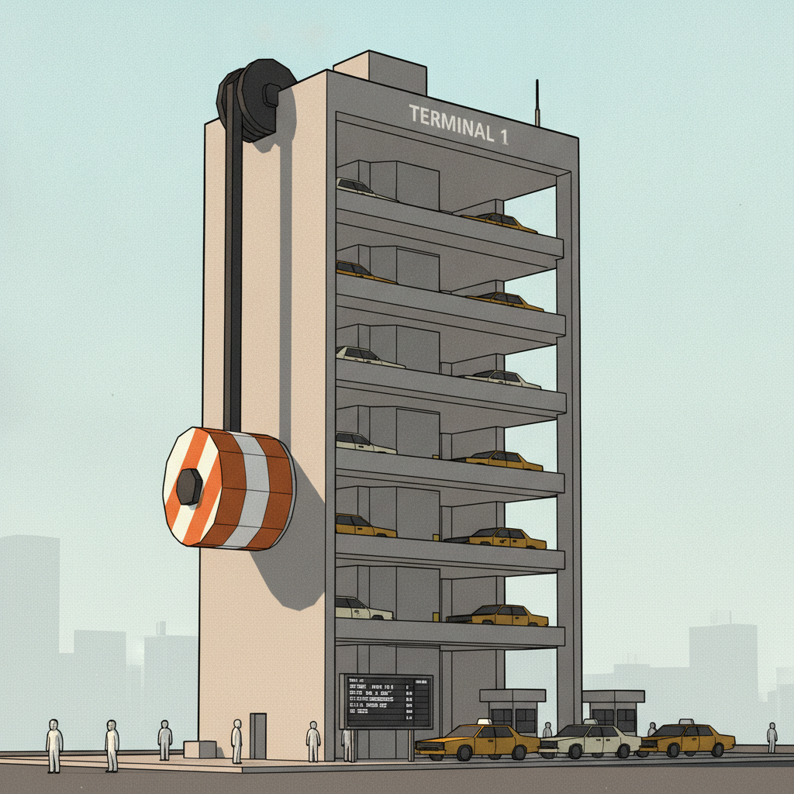
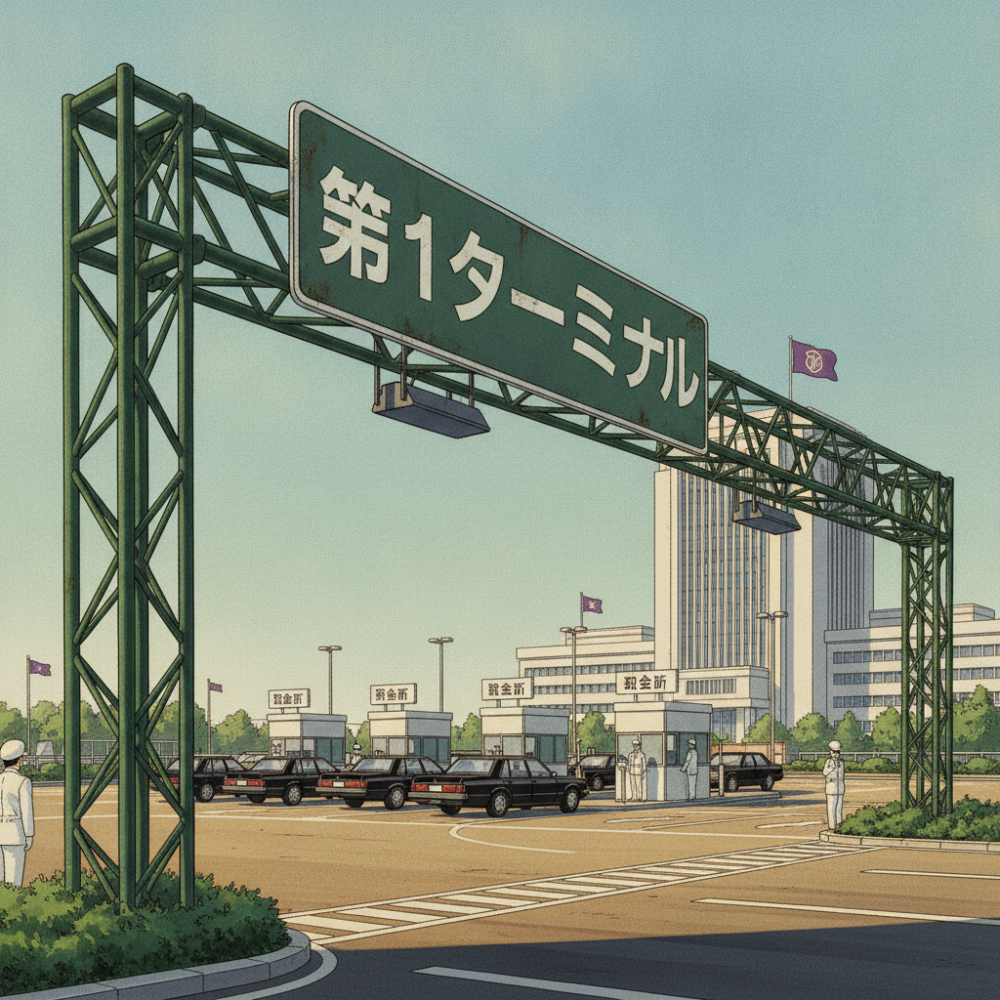
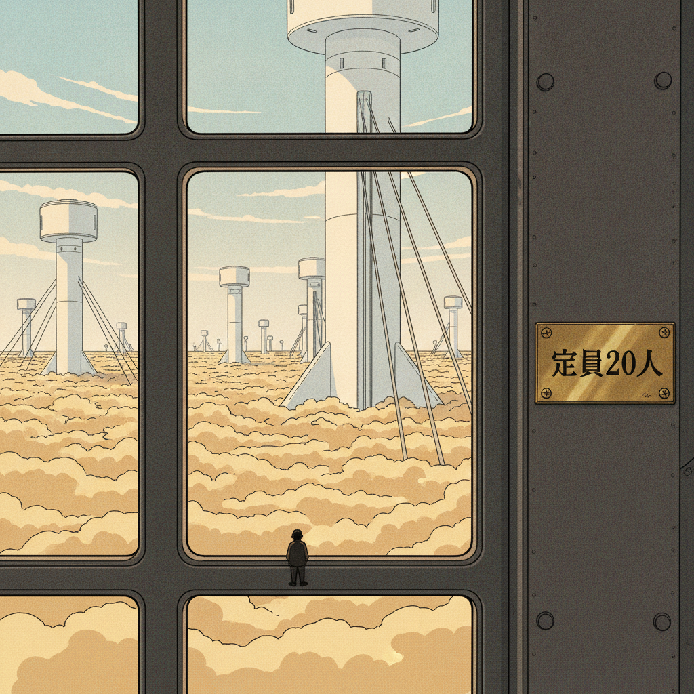

# THE AERIUM — Upper City Art-Book Chapter
### KUROGANE BAY / Tokyo Drift 3D — the gig-driver game

*Chapter writer: Upper City artist. 2026-10-05. Canon sources: world bible v2, retrofutur identity plan (§8 DO/DON'T are hard law), Showa-dust extrapolation. Design research: 3 Gemini consult rounds (daytime expressway cel direction; Showa-Metabolist arcology design; production-translation check) — digested below, never quoted. 5 REFERENCE 2D mocks + 3 IMPLEMENTATION game-screenshot mocks, all verified pixel-by-pixel before embedding.*

---

## 0. The half-second rule (the Lower/Upper contrast law)

A single glance at the horizon or the ambient light must tell the stratum. This is the chapter's load-bearing requirement:

| | LOWER CITY — "The Trench" | UPPER CITY — "The Aerium" |
|---|---|---|
| **Sky** | Never visible; murk to 100 m, then the industrial underbelly of the Upper (conduit bundles, elevator tracks, foundation plates) | Open pale-blue sky, thin high cirrus, 360° horizons |
| **Light** | Amber murk, sodium haze, umber shadows | Clean pale sunlight, halogen-white noon, warm umber shadows |
| **Ground plane** | Dust-caked, littered, oil-stained | Sealed white concrete, washed, maintained |
| **Buildings** | Capsule towers, rusted turnbuckles, exposed ducting | White board-formed concrete megastructures, plug-in pods, terracotta roofs |
| **Roads** | Trench grid: narrow, 90° intersections, stop-and-go, high-friction | Skyway ribbon: curvilinear viaducts, banked ring roads, low-friction, top-speed |
| **Vehicles** | Dust-armored, cyclone filters, tarped roof-racks | Clean, sealed, altitude-compensated, waxed |
| **Signage** | Enamel, sand-blasted, hand-stenciled | Enamel, split-flap Solari boards, JH Gothic, maintained |
| **Humans** | Hidden, masked, drive-up only | Visible at a distance, masked as *fashion* |

**Palette law (identity §8):** the Upper City is the ONLY place cool tones are allowed. Canon: clean off-white `#EDEAE0`, halogen white, deep imperial purple `#3D2B50`. Everything else stays warm: ivory/sandstone concrete in sun, dry ochre-grey shadow bands, warm umber cel-shadows. Imperial purple is reserved for *accents of power* — corporate monogram flags, Minami board livery trim, Adaeze's cap braid — never buildings. A purple building is an instant fail (the PR #358 lesson).

**The noon-lock rule (the PR #358 lesson, canonized):** these layouts exist ONLY for bright midday. Night-flipping a daytime design swallows the ink linework (daytime cel needs 75–95% luminance surfaces against 100% black ink), triggers the panic-neon trap, and reverses air perspective into muddy purple fog. There is no night Aerium. Ever.

---

## 1. HAIBARA HEIGHTS — clifftop estates above the cloud

*District 7. Tycoon demilitarized zone. The dust is a distant amber sea below the cliff; the air is clean, thin, and quiet. Gig profile: luxury limo work, discreet personal deliveries (tapes, wine, pedigree pets), silent rides — never look in the mirror.*

*[REFERENCE] Mock 2 — a clifftop estate: terracotta kawara roof, kuromatsu pine, ishigaki wall, the dust sea below.*

*[IMPLEMENTATION] Impl 2 — the shipped-game camera framing: solid terracotta roof wedge, stone-textured retaining hull, low-poly pine blobs, banded dust-sea plane.*

### Building types
**Showa-modernist clifftop villas** — the language of Antonin Raymond and the Isozaki residential phase, not the Mediterranean:
- Low-slung horizontal cantilevers of **bush-hammered concrete**, paired with charred Japanese cedar (*shou sugi ban*) screens.
- **Terracotta kawara roofs** in Japanese profile (half-round ridge tiles, deep eaves) — canon per district signature. HARD LINE: never Spanish barrel tile, never Mediterranean stucco, never kidney pools — those betray the setting instantly. Copper valley flashing patinated turquoise is the correct metal accent.
- Glazing in **dark bronze-anodized aluminum**, proportioned like sliding shoji/fusuma screens — modular bays, never sweeping frameless panoramas.
- Flat-roof variants with gravel ballast and cast-concrete coping stones (the Isozaki end of the street).
- White plaster garden walls with terracotta coping; **estate gates** with brass intercom grilles and enamel nameplates; gatehouses sized for a single guard.

**Gardens (the status signal):** wind-sheared Japanese black pine (*kuromatsu*) wired into horizontal silhouettes; dwarf sago cycads; dry raked-gravel courts (*karesansui*); cyclopean dry-stacked volcanic-stone retaining walls (*ishigaki*) at the cliff edge; shallow dark-bottomed reflecting basins spilling over slit-weirs; stone lanterns. No lawns — lawns are a water crime in a dust city.

### Unique buildings
- **The Grand Haibara Auction Hall** — white concrete drum on a stone podium, terracotta ring roof, slit windows only (what's auctioned inside is never advertised on the facade). High-society auctions, money laundering with a gavel. *(Art-book addition; not in bible canon — see Open Questions.)*
- **Estate decon-porticos** — every villa entrance has a small air-lock pavilion: UV fog nozzles, boot-wash grates, a sealed door within a door. Decontamination-adjacent architecture made domestic. Guests arriving from below are *scrubbed like cargo*.

### Street props (Haibara)
- Ishigaki cliff-edge retaining walls with brass survey plaques; estate boundary stones; gravel pull-offs instead of sidewalks (nobody walks — the Kuro-Kiri ordinance still holds).
- Private drive-up courier hatches: a brass pneumatic-tube receiver set into the garden wall, enamel-numbered.
- Trimmed hedge lines in cast-concrete planters along the estate ring road; the only vegetation at road level, maintained by unseen gardeners.

### Vehicles (Haibara)
- **Limo class**: Ohtori Sovereign stretched sedans in black/cream two-tone, lace curtains, chauffeur-driven. The vehicle clients inspect before they inspect you (Appeal ≥ 70 is the fare gate).
- Private-security patrols: white SUVs with imperial-purple stripe, full blackout glass, roof searchlight on a push-rod (never a sensor blister).
- No haulers, no kei vans — freight arrives sealed and unmarked.

### Characters (Haibara)
- **Executives**: tailored suits over porcelain or lacquered **fashion half-masks** — the Upper City answer to the mask law. A mask here is a status object: white porcelain for old money, black lacquer with a painted accent for the ambitious. No faces, ever (character law holds above the cloud).
- **Private security**: white coveralls, full-face industrial respirators, mirrored goggles, no insignia but a numbered enamel shoulder plate. Polite, silent, everywhere.

### Items & props (Haibara)
- Sealed wine crates with wax-stamped manifests; pedigree-pet carriers (ventilated, brass-latched); acetate tape reels in padded cases (the Record-Shop Phantom's clients live here); auction paddles numbered in enamel; paper scrip in fat envelopes.

---

## 2. MINAMI AERIUM — the arcology district

*District 8. White concrete towers, skybridges, corporate plazas with 360° horizons; sky-elevator Terminals 1 & 3. Councilman Minami's transport-board HQ. Gig profile: corporate courier runs, toll-jurisdiction escapes, executive extractions, decontamination-dodging smuggles.*

*[REFERENCE] Mock 1 — the skyway ribbon: banked viaduct threading Metabolist arcologies, form-tie holes, capsule pods, green enamel signs.*

*[IMPLEMENTATION] Impl 1 — low-poly box towers with tie-hole texture, instanced box pods, box-beam toll gantry, simplified traffic.*

### Building types — Showa-Metabolist arcologies
The lineage is Nakagin Capsule Tower, Tange's bay plan, Expo '70 — **skeleton and cells**, never monoliths:
- **Slip-formed mega-cores** (stair/elevator/service) flanked by **cantilevered bracket-seats** where modular pods bolt on via visible unpainted high-tensile steel mounting plates. The skeleton/pod cleavage must be legible — a smooth seamless tower is generic sci-fi and fails review.
- **Plug-in capsules**: concrete pods with porthole or squircle windows sealed by thick black neoprene gaskets (never flush curtain glass). Window rhythm is the facade's heartbeat.
- **Board-formed white concrete** with the 1 m × 2 m formwork grid and **P-con form-tie holes** as crisp ink dots — the anti-sterility device. Weathering streaks run tight and vertical, ONLY beneath drainage spouts, expansion joints, and parapet caps (high altitude bakes surfaces chalky-white; grime has nowhere to hide).
- **Exposed external MEP risers**: spiral-welded galvanized ventilation ducts, cast-iron wastewater risers, corrugated utility trays on raw unistrut brackets climbing the cores.
- **Expo-era space-frame trusses** (tetrahedral ball-joint) bridging towers and anchoring plazas — painted safety orange, pale gray, or faded cream.
- **Rail-mounted gantry cranes** crowning the primary cores, yellow-and-white: the building is *maintained*, pods are extracted and replaced. Maintenance culture is visible in the structure.
- **Heavy brise-soleil concrete fins** shading modules — cast draft angles, never thin aerodynamic sheet.
- **Skybridges** at two or three levels: enclosed white-concrete tubes with ribbon windows, or open truss spans with expanded-metal decking, double-pipe handrails, and cage-ladders.
- **Ribbon glazing** as solid high-key cobalt-to-cyan gradient bands broken by razor-sharp white diagonal glare strikes — never realistic reflections.

### Unique landmark buildings
- **Minami Metropolitan Transport Board HQ** — the toll empire's citadel: the tallest core in the Aerium, ringed by its own private banked loop road, crowned with the board's mon in imperial purple. Deadpan, windowless at the crown. The Minotaur's office has no windows — he doesn't need to see the city to tax it. *(Tone: played 100% straight. No jokes, ever.)*
- **Moriyama Heavy Logistics Tower** — harbor-facing arcology with a dock-tariff Solari board the size of a tennis court on its flank; container-crane motifs in the concrete fins. Baroness Moriyama's tariffs are posted here in brass numerals.
- **KPC Executive Tower** — the Sol-88 monopoly's clean face: the whitest concrete in the city, a single flare-stack motif worked into the crown (the refinery, aestheticized). Corporate police motor pool at its base.
- **Terminal 1 & Terminal 3** — the two Aerium sky-elevator terminals (see §3).

*[REFERENCE] Mock 3 — Terminal 1: open freight decks riding cables, striped counterweight drums, Solari boards, taxi queues.*

*[IMPLEMENTATION] Impl 3 — box tower, ledge decks with concrete crash lips, one thick tension rod, flat Solari quad, low-poly taxi queue.*

### Street props (Minami)
- **Toll gantries**: pale-gray angle-iron lattice spans with transformer boxes and maintenance walkways; deep-green enamel signboards, white JH-Gothic kanji dominant over small English Helvetica subtext, reflective white borders; mechanical **split-flap fare boards** that clack as toll brackets update; yellow triangular warning pictograms.
- **Toll booths** with coin-hopper slots and pneumatic receipt tubes; bribe-chute receivers (a fat envelope of scrip fits the kōban pattern).
- **Decontamination arch gantries** on the terminal approach roads: UV lamp bars, chemical-fog nozzles, enamel warning plates — scrubbers as street furniture.
- **Hijō denwa emergency call boxes** (the orange pillar phone) at viaduct intervals — a human metric for scale.
- Plaza set: white concrete paving in a radial pattern, trimmed hedges in cast planters, flagpoles with corporate mon flags, a central Solari departure board, perimeter bollards with purple bands.

*[REFERENCE] Mock 4 — a corporate plaza: 360° horizon, split-flap toll boards, parked executive sedans, HQ tower with monogram.*

### Vehicles (Minami)
- **Corporate sedans**: Ohtori Sovereigns in black/ivory, vacuum-tube taillights, altitude compensators standard (a Lower tune runs rich and smoky upstairs — and attracts corporate police).
- **Security patrols**: white pursuit sedans with purple stripe, mechanical roof sirens, push-bars — the KMTED's clean cousins, better funded, worse humored.
- **Courier capsules**: brass pneumatic cylinders on Tatsumi Hauler roof-racks, sealed and lead-lined for the decon dodge.

### Characters (Minami)
- **"Highline" Adaeze Okafor** — Terminal 1's dispatcher-queen. White uniform with gold-braided cap, **porcelain half-mask**. Controls who rides up and who waits; politeness is a weapon. Gatekeeper gigs: earn her favor for Express Freight Line access, or run the broken industrial lifts. Her booth overlooks the car decks; her Solari board is the terminal's heartbeat.
- **Corporate couriers**: gray suits, gray half-masks, brass capsule cases chained to the wrist.
- **Terminal security**: white armor-shell coveralls, full-face respirators, numbered plates; they sweep for contraband during the queue window.

### Items & props (Minami)
- Toll scrip tokens (stamped brass); punched ROUTE-88 cards for the Upper layer (clean blue vector wireframe redraw); lead-sealed smuggler trunks (heavy — changes drift physics); corporate courier capsules; Express Freight Line monthly passes ($500k — the endgame money sink).

---

## 3. The skyway ribbon — road topology (the anti-trench)

**The two layers must NEVER feel like the same street grid.** Where the Lower City is a trench grid — narrow, 90°, claustrophobic, stop-and-go — the Aerium is the **skyway ribbon**:

- **Curvilinear multi-lane viaducts** threading between arcologies in long S-curves; **banked perimeter ring roads** around tower clusters; sweeping on/off-ramps with 200 m sight lines.
- **Low-friction, top-speed cruising**: the Aerium is where the Raiden Fastback and Mirage Zero live. Cornering is committed sweepers, not alley flicks. Altitude compensators and sealed bearings are the required kit.
- **Showa civil-engineering anchors** (so it never reads as sci-fi):
  - Hammerhead bents or inverted-U portal frames, chunky chamfered corners, visible lift lines, **cast-in black stencil registration numbers** on every pier.
  - Dual-tier corrugated W-beam guardrails on square H-beam posts; mint-green acoustic-barrier walls with scratch-mottled acrylic observation windows.
  - **Finger-plate (tooth-comb) expansion joints** across the deck; cast-iron drop scuppers feeding exterior downspouts strapped to pier faces.
  - Cobra-head sodium lamp masts — unlit by day, faint orange reflectors visible in dirty glass.
  - Box-girder deck undersides routed with bracketed utility conduits, perforated inspection runways, and **yellow clearance bars on steel turnbuckles**.
  - Pier bases wrapped in riveted steel seismic jackets, oxidized red-orange primer or utility gray.
- **Scale anchors, never deleted by the look**: hijō denwa boxes, 85 cm crash barriers, maintenance hatches, catwalks, cage-ladders. Stylization means simplified rendering, not omitted engineering — without the human metric, a 100 m viaduct reads as a plastic toy.

*[REFERENCE] Mock 5 — the cloudbreak: arcologies rising from the dust sea, ring-road viaduct, elevator cables descending.*

### The cloudbreak vista (the signature shot)
From the ring road's highest banked turn: an endless ochre cloud sea to every horizon, white towers rising from it, one elevator tower's cables plunging into the deck below. This is the Aerium's rooftop moment — Tekkonkinkreet's murk-below/clarity-above, earned by riding the elevator instead of climbing. The 8-second ascent's Gig Triage Screen plays against this view.

---

## 4. Daytime cel-direction rules (digested from consult)

1. **Noon-lock**: exposure, local values, and cel separations are authored for midday only. No night variants, no dusk grades. (The PR #358 failure, canonized as law.)
2. **Concrete shading**: sun face = pale ivory/sandstone/bone (5–10% yellow bias); step-1 shadow = dry ochre-grey/muted khaki, warm terminator; ribbon windows = cobalt-cyan gradient bands with white glare strikes. Second bands never purple.
3. **Anti-sterility**: formwork grid + P-con tie holes as ink marks; vertical weathering streaks only under spouts/joints/caps; exposed risers, cranes, catwalks break the mega-surfaces.
4. **Air perspective**: desaturated, high-key warm sky-wash with distance — never blue-shifted into cold haze, never purple fog.
5. **Emissive restraint** (identity §8): only filaments, phosphor CRTs, vacuum tubes — harsh, local, clipped. No volumetric glow soup. The Aerium at noon barely needs emissives at all.
6. **Tech ceiling**: spherical-CRT glass, rocker switches, thumbwheels, Solari boards, pneumatic tubes. No flat LCDs, no holograms, no neon soup, no carbon fiber, no seamless injection-molded blobs.

---

## 5. Upper City mask culture (character law, applied above the cloud)

Craig's character law holds at every altitude: **no faces are ever modeled.** Above the dust, the respirator becomes the **porcelain half-mask** — a fashion/status object, not survival gear:
- Old money: white porcelain, unadorned. The ambitious: black lacquer with one painted accent. Functionaries (Adaeze): white uniform porcelain with gold braid.
- Security and terminal staff keep full-face industrial respirators — the working mask vs. the society mask is a class read the player learns without a word of dialogue.
- Private-security shoulder plates are numbered enamel — identity by number, never by face.

---

## 6. How the Aerium plays (systems, not jokes)

Craig's law: comedy emerges from systems. The Aerium's systemic engines:
- **The sealed trunk tradeoff**: lead-lined smuggler trunks beat the decon scrubbers but add mass that changes drift physics on banked sweepers — smuggling upstairs is a handling puzzle, not a stealth meter.
- **Toll-jurisdiction escapes**: corporate district borders end KMTED authority (Heat 3 excepted) — the ring road's toll gates are shed mechanics you drive through at speed.
- **The altitude tune**: a Lower City carb tune runs rich upstairs, smoking visibly and drawing corporate police — the altitude compensator is a purchase with a visible consequence.
- **Queue physics at the terminals**: the Express Freight Line vs. the Commercial Hopper is a standing-and-scrip gamble played in the queue lanes; inspection triage (toggle the scrambler, bribe the gatekeeper terminal, or sweat) runs during the wait.
- **The Meter Maid, elevated**: she has no jurisdiction above the cloud — which is exactly why an Upper City parking ticket, when it rarely happens, is issued by a *corporate* warden with a bigger book. *(System fact, not a gag.)*

---

## 7. Lower/Upper contrast checklist (for every future Aerium art task)

- [ ] Half-second stratum tell: white concrete + open sky + halogen noon (never amber murk)
- [ ] Roads read as skyway ribbon (curvilinear, banked, multi-lane) — never a trench grid
- [ ] Buildings daylight-warm (ivory/bone/terracotta) — never purple, never night-flipped
- [ ] Skeleton/pod cleavage legible on every megastructure — no seamless sci-fi monoliths
- [ ] Showa anchors present: enamel signs, Solari boards, W-beam rails, lattice gantries, cobra-heads, hijō denwa boxes
- [ ] Scale anchors present: expansion joints, catwalks, barriers, hatches, maintenance hardware
- [ ] Cool tones only as power accents (imperial purple flags/livery/trim)
- [ ] Every human masked; Upper masks are porcelain/fashion, never bare faces
- [ ] No neon soup, no holograms, no flat LCDs, no digital-era form factors
- [ ] Tech is stamped steel, vacuum tubes, bakelite, rivets, pneumatic brass

---

## 9. Production translation — what the shipped 3D actually looks like

Two mock layers per scene from here on: **[REFERENCE]** (aspirational, painterly, art-directed) and **[IMPLEMENTATION]** (low-poly + AnimeLook cel-shader mock — flat color fields, ink outlines, cel shading bands, washed-out texture noise — what the final 3D reads as at the driving camera). Impl mocks were generated against the reference compositions and verified pixel-by-pixel: game-screenshot read, no painterly drift, no unmasked faces, no neon, no night, buildings daylight-warm never purple.

Digest of a Gemini technical-art consult (`consult/translation-check.md`) informed every cut below. Tech rules the impl layer must follow:

- **Arcology facades are boxes, not sculptures.** P-con form-tie holes, slip-form banding, window gaskets: 100% texture on a 512px trim sheet. Modeled holes at driving distance cause shimmer and triangle-setup waste. Pod-cleavage is the ONE thing that stays geometry — pods must cast shadows and step the silhouette, so they ship as simple instanced boxes (12 triangles) penetrating the core, no air gaps behind them.
- **Inverted-hull outline is rationed.** Anything thinner than 2× the hull grow amount turns into solid black ink. Thin cables, lattice trusses, alpha-tested leaf cards, and wire railings get NO outline pass — high-contrast albedo carries the edge instead, or the part gets replaced (below).
- **Vehicles: 300–450 tris traffic, 800–1000 hero.** Survives: wedge silhouette, opaque flat-color glass, 8-sided prism wheels. Dies: wheel wells, mirrors, wipers, interiors, headlight geometry (flat emissive quads).
- **Humans are 2D billboard impostors** — ink-baked sprite atlases, masks included, culled beyond 35 m. No skinned 3D characters, ever (mask law is also a budget law).
- **The dust sea is one flat unlit quad** — two scrolling noise bands quantized into ochre/amber, depth-faded at the cliff. No volumetrics, no stacked translucency.

### Impl 1 — skyway ribbon (skyway viaduct)

**Survived:** the banked S-curve, the tower-pair framing, green enamel kanji signs on a gantry, cobra-head lamp masts, portal-frame piers, simple low-poly taxis. **Cut:** open-web lattice gantries → solid box-beam portals (lattice + hull outlines = black mush); wall-climbing MEP pipe networks → pipes only on silhouette edges, the rest painted into the trim sheet; thin railing meshes → solid concrete Jersey barriers; individual window reveals → painted gaskets on pod boxes. **Kept as geometry:** the capsule pods — without real pods the towers collapse into plain boxes and the Metabolist read dies. **Flag:** the reference's cobra-head lamp masts are drawn unlit; in 3D they must stay unlit-by-day meshes (faint orange reflector in the glass painted, not emissive) or the noon-lock breaks.

### Impl 2 — Haibara estate (clifftop villa)

**Survived:** terracotta roof as a solid wedge plane with tile-row texture, white plaster villa body, garden wall with terracotta coping, beveled retaining wall with painted stone texture, pine tree (hull-outlined trunk, convex foliage blobs). **Cut:** individual 3D kawara barrel caps → directional banded texture on the wedge (modeled caps at this scale are polygon waste); stone-by-stone ishigaki → single hull + non-repeating stone texture; alpha-cutout foliage → solid low-poly blobs (leaf cards render as a black jumble under inverted-hull). **Flag:** the reference's long horizontal cantilevered volumes are hard — the first impl attempt rendered the roof as a red-and-white striped awning and was rejected/regenerated. The villa's full horizontal massing will read best from a slightly elevated approach-camera; from ground level the player mostly sees garden wall + roof ridge, which is the honest shipped view — the wide estate vista is a REFERENCE-only framing. **Flag:** the banded dust-sea plane can look posterized if the two bands are too hard; the shader needs soft-scroll noise between the bands or the horizon reads as a bar code.

### Impl 3 — Terminal 1 (car sky-elevator)

**Survived:** the box tower massing, five open car decks with solid crash lips, low-poly taxi queues in cream/ochre, the striped orange-white counterweight drum, the flat Solari departure-board quad, toll booths. **Cut:** multi-strand elevator cables → ONE thick hexagonal tension rod with flat black albedo (thin cables under hull outlines become solid ink bars); open safety mesh fences → solid 1 m concrete crash lips; mechanical Solari flap drums → stepped UV-scroll emissive quad (flaps that physically flip are rigged animation nobody will ever inspect). **Flag:** the counterweight drum wants to read "hazard-orange industrial" — if its diagonal stripes drift toward toy-like or clownish at ship resolution, shrink the drum and deepen the orange toward #E65C00. The reference's elegant cable sheave composition does not survive as rigging — it survives as massing + striping.

### Honest flags — what the reference layer cannot promise

1. **Reference camera framings are not the shipped cameras.** The references are wide painterly vistas; the impl mocks are framed at the driving/elevator camera. Mock 5 (cloudbreak vista) has no impl pass — the full vista survives in-game as the flat dust-sea shader plane + distant simplified tower silhouettes, not as a designed composition.
2. **Texture resolution is the new bottleneck.** Once geometry is cut, the trim sheets (form-tie grid, kawara bands, stone courses) carry the Showa read. They must be authored at 512px tiled with crisp ink marks — blurry textures turn the towers into generic sci-fi boxes faster than any geometry cut.
3. **Daylight-warm must be authored, not assumed.** The impl layer keeps drifting cool-grey on tower shadows (visible on impl-1's piers). The cel shadow color must be pinned to dry ochre-grey/muted khaki in the shader, not left to the renderer.
4. **No impl pass was generated for the corporate plaza (mock 4).** Its toll gantries and booths reuse the exact same translation rules as impl-1/impl-3 (box-beam portals, solid booths); a plaza impl pass is queued if a corporate-district gameplay task needs it.

---

## 10. Open questions

1. **No "BIBLE DELTA" markers found** — grep over `~/workspace/game-design/` returned zero hits; nothing in the canon sources is flagged pending.
2. **The Grand Haibara Auction Hall** (§1) is an art-book addition, not bible canon — needs Craig's approval or a bible amendment.
3. **Mask-law boundary**: the bible's mask law is dust-protection motivated; the porcelain fashion half-mask above the cloud is this chapter's extrapolation. Confirm Craig wants the law to hold at altitude (recommended: yes — it preserves the mystery-and-cheap identity and the half-second character read).
4. **Terminal faction control**: bible says terminal control is the endgame war map and Terminal 2 anchors Tenjin — but which faction currently holds Terminals 1 & 3 (Minami's board? contested?) is unanswered. Needed before briefing terminal-set-piece tasks.
5. **Upper City policing**: KMTED authority ends at corporate borders — but who writes the tickets on the skyway ribbon day-to-day: corporate security, or a KMTED sky division? Affects the cop-system brief.
6. **Estate interiors**: art book is 2D/exterior only per this brief — but gig design will eventually need villa gate/drop-off interaction points (courier hatches are proposed in §1; needs a gameplay pass).
7. **Terracotta guardrail**: bible canon says terracotta roofs; design research warns Spanish barrel tile betrays the setting. This chapter resolves it as Japanese-profile kawara in terracotta — flagging the resolution for Craig's confirmation.

---

*Two mock layers per chapter (Craig 2026-10-05): REFERENCE files — `mock-1-skyway-ribbon.png`, `mock-2-haibara-estate.png`, `mock-3-terminal-1.png`, `mock-4-corporate-plaza.png`, `mock-5-cloudbreak-vista.png` (all 80s-anime cel, daytime, verified: no neon, no night, no purple buildings, no unmasked faces). IMPLEMENTATION files — `impl-1-skyway-ribbon.png`, `impl-2-haibara-estate.png`, `impl-3-terminal-1.png` (low-poly + AnimeLook game-screenshot mocks, verified: no painterly drift, no unmasked faces, no neon, no night, daylight-warm never purple). Impl-1's first estate attempt (striped-awning roof) was rejected and regenerated; impl-2 ships with the camera pushed closer to the estate per §9 flag.*
*Consult notes (process, not canon): `consult/daytime-art-direction.md`, `consult/arcology-design.md`, `consult/translation-check.md`.*
