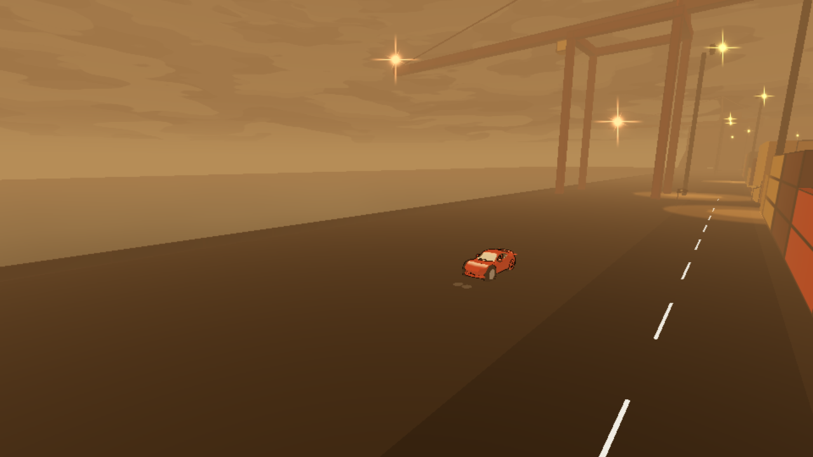
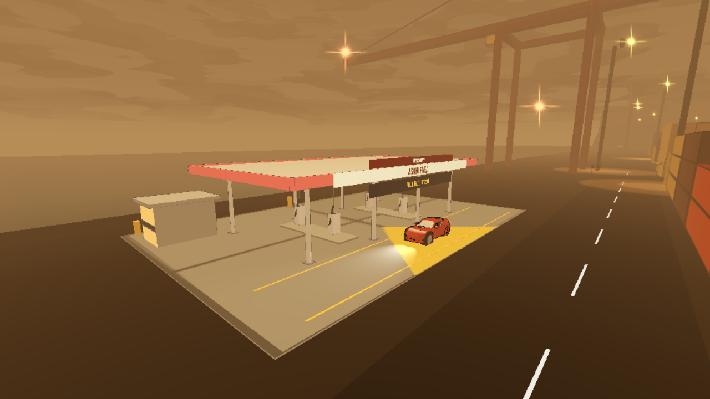
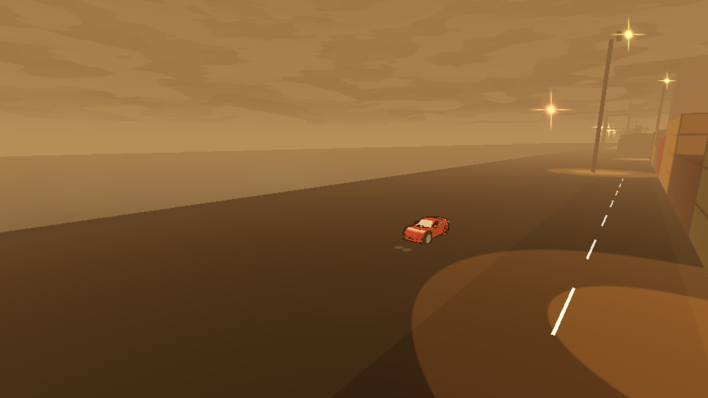
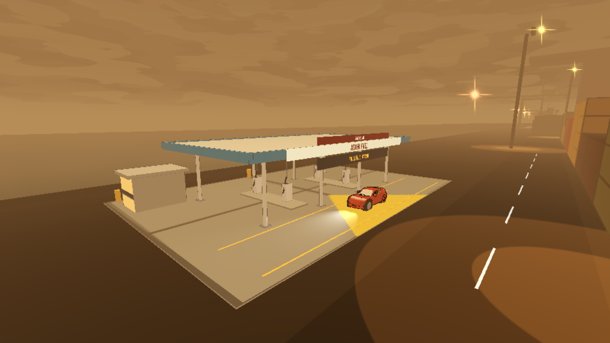

# td-206 fuel / paid recovery — review package

**Latest correction:** [FuelHud clears Wanted in the pinned combined build](wanted/README.md): fuel694750e + dotad531cc6;496 native/496 browser layout checks,62 fuel/31 native modal/35 browser modal regressions pass. This is not current-main acceptance; parent will align new map/health/final446 heads. Natural wreck hookup and phone verdict remain.

**Prior correction:** [P2 modal/pause fix and final-source results](modal/README.md), runtime `825a1db`. 62 fuel + 31 modal native checks, 35 modal + 10 economy Web checks passed. The older feature/camera evidence below remains tied to its stated source. The independent reviewer reported 52 pre-entry errors; local run-specific counts and unchanged-baseline classification are recorded in the correction package.

Draft source PR: https://github.com/doublehidenblade/tokyo-drift-3d/pull/457 . Central reservation: https://github.com/doublehidenblade/game-dev-central/pull/330 . No merge, Actions or publication.

## Verified source and evidence

Gameplay source **`effc7e6d4a90a030e74e847c6664d1355892d62d`**; base **`389d4a839c1c5974a335b4d063566a20a77b4dd1`**. Final evidence/docs commit changes no gameplay code. [verification.json](verification.json) records runtime file hashes, engine/export hashes and fixture settings. The final camera harness disables traffic identically in both builds for unobstructed geometry comparison; the previous traffic-occluded shots remain in `after-with-traffic/`. Web evidence uses normal game traffic.

| Check | Result | Evidence |
|---|---|---|
| Real station drive-in, stop, fill, drive-out, transactions, braking, arrest, restart | 62 passed / 0 failed | [runtime log](edge-head-final.log) |
| Two gigs, then actual road drive to East Quay and refill | 0 failed / 0 stuck; 1.191 km reserve | [route log](route-head-final.log) |
| Portrait / landscape bounds, touch targets, all displayed modal glyphs | 0 failed | [HUD log](hud-head-final.log) |
| Exported browser, real touch cancel/pay, gig access, pending quote/reload | 10 passed; 0 errors after city entry | [Web result](web/result.json) |
| Same camera matrices at both locations | 4 exact pairs | [before log](before-still-final.log), [after log](after-still-final.log) |

| Site | Before | After |
|---|---|---|
| West Quay |  |  |
| East Quay |  |  |

[West readable approach](after/quay_west-approach.png) · [East readable approach](after/quay_east-approach.png) · [native portrait fill](hud/portrait-confirm.png) · [actual Web portrait payment](web/portrait-confirm.png) · [Web landscape payment](web/landscape-confirm.png) · [premium tow](hud/empty-tow-confirm.png) · [wreck run-over](hud/wreck-game-over.png) · [empty-fuel run-over](hud/fuel-game-over.png).

All four final station views, the before views, phone layouts, both run-over screens and actual Web confirmation pixels were personally inspected. Native and browser screenshots are software-rendered evidence, not a phone approval. The Web menu still logs pre-existing Tokyo Bay pole/sode/td-119 asset failures before entering Lower City; `bootErrors` retains them. Final route logs a Jolt job-queue warning during concurrent local verification, with deterministic results unchanged. No FPS/device performance claim.

## Scope and interfaces

- `FuelService.balance_yen()` derives the run balance from starting allowance + existing `GigDispatch.earnings` − settled costs. There is no second earned-income authority. Its synchronous quote/confirm path validates current state, reserves a clear recovery bay, settles payment/fill once, then signals/places the car. Duplicate/stale/cancelled quotes cannot pay again.
- `FuelService.range_snapshot()` returns a deep independent dictionary: `vehicle_id`, `capacity_km`, `remaining_km`, `traveled_m`, `distance_semantics`, `low_range`, `balance_yen`. No route or marker is created. Muse owns td-203/205; recommended gig/marker distance is drivable road-route metres / 1000, including approach legs. Straight-line distance is a labeled lower bound and must not promise reachability.
- `FuelProfile` is a per-vehicle resource (starter coupe now). Capacity, warning threshold, allowance, fill/tow/salvage costs are data. Future mini-truck and tank upgrades select another profile. `yen_per_missing_km` is a reserved pricing extension only: future quote = disclosed rate × missing range, revalidate and debit through the same settlement. No hidden proportional charge now.
- Existing Lower City has cargo condition, not a chassis-health authority. td-204/health owner calls `report_chassis_wreck(unique_event_id)` when a REAL chassis wreck occurs and listens to `chassis_recovered(event_id)` to restore their authority's health. Resolved event IDs are remembered so a replay cannot create a second salvage bill. This task does not infer wrecks from cargo or implement damage numbers. Wreck fixtures prove the recovery interface, not a natural gameplay crash-to-wreck event.
- Existing `place_car()` now emits `car_transported`: distance baselines/quotes reset, with no debit or fill. PR446 at `ad531cc69720512984f2e9686b1ec42dbf357d7e` remains separate and unmerged; preserve its reset/LOS/HUD work when integrating. Keep this signal after its final placement/reset and keep fuel's motor block. No police files were changed. Automatic arrest uses its existing settlement; player-selected paid recovery uses the narrow `GigDispatch.fail_recovery()` adapter.
- Paid optional home recovery supersedes the old C-key free rescue. Future home resources/repair are extension points only; no garage, map, marker or health HUD implementation here.

## Economy and calibration

Start: **7.5 km / ¥5,000**, warning at **2.5 km**. Flat full fill **¥1,200**, even for a partial tank; full tank is free/no operation. Empty roadside tow **¥1,800 + ¥1,200 fuel = ¥3,000**. Home salvage/recovery **¥2,000**, plus a separately disclosed ¥1,200 fill only if empty. Confirm shows before/after balance and range. Cancelling never charges. An unaffordable voluntary home recovery also offers a clearly labeled fresh run, so an off-world recovery prompt cannot become a no-exit softlock. Unaffordable empty fuel and wreck have separate run-over reasons and fresh-run action.

`test_td206_route.gd`: real current-car physics, two initial offers (Starlight → Gate 2; Asahi HQ → Gate 7), including travel to pickups: **6,044.740 m**, both delivered on time, 100% cargo, **¥7,570 earned**, **1.455 km** remaining. Continuing without teleport to East Quay: **264.214 m**, **1.191 km** reserve, zero stuck events; confirmed fill leaves ¥11,370. Traffic is disabled only in this reproducible calibration fixture. The retained busy-traffic trial failed cargo/timing; this is not a claim that all traffic conditions or every offer pair fit two gigs.

West station is at plan **(671, 13.5)**, East at **(1857, 13.5)**. Both are add-on scene assemblies on the existing quay apron, south of the road; original city data/world and td-174 GLBs are untouched. `station-plan.png` shows footprint/lot/road checks. Existing Showa enamel kit, warm active-map lighting, mounted price/brand signs and four pumps per station are reused.

## Persistence and acceptance limits

Lower City has no run save/load authority. This implementation is explicitly run-scoped: scene restart/reload discards fuel, earned cash, costs and pending quotes together and starts ¥5,000 / 7.5 km. No files/accounts are deleted. If save is introduced, persist the range, existing earnings, spending ledger, quote sequence and settlement IDs in ONE authoritative save transaction; never save wallet debit separately from service state. Crash-safe cross-reload transaction durability is not claimed.

Native 844×390 / 390×844 screenshots and layout assertions test this fuel UI, not the out-of-scope GigHud/map scaling. Local Web touch checks are separate. Neither software-rendered browser emulation nor Xvfb is a physical phone acceptance/performance verdict. Craig's phone review and a real chassis event hookup remain integration gates.

## Reproduction

Use pinned `.tools/Godot_v4.7.2-stable_linux.x86_64` (4.7.2 `ed1daf0bf`), first run `--headless --editor --path godot --quit` to import assets. Two tracked font import descriptors previously pointed at all-zero cache hashes; this branch normalizes those paths. GLB extracted textures are generated import outputs, not new authored assets.

From source root, add writable XDG_CACHE_HOME / XDG_CONFIG_HOME / XDG_DATA_HOME if needed:

```sh
.tools/Godot_v4.7.2-stable_linux.x86_64 --headless --path godot --fixed-fps 60 -s tools/test_td206.gd
.tools/Godot_v4.7.2-stable_linux.x86_64 --headless --path godot --fixed-fps 60 -s tools/test_td206_route.gd
# Native pixel evidence (needs a display; uses actual LowerCity scene)
.tools/Godot_v4.7.2-stable_linux.x86_64 --path godot --rendering-driver opengl3 --audio-driver Dummy --fixed-fps 60 -s tools/capture_td206.gd -- res://qa/td-206/after
.tools/Godot_v4.7.2-stable_linux.x86_64 --path godot --rendering-driver opengl3 --audio-driver Dummy --fixed-fps 60 -s tools/capture_td206_hud.gd
```

Before source is main `389d4a839c1c5974a335b4d063566a20a77b4dd1` in an isolated detached worktree, with identical capture harness, station coordinates fixture, camera matrices, font import metadata and generated import cache. The fixture contains no stations; the after build does. Comparison captures hide existing HUD layers only to expose geometry; separate gameplay captures retain the real HUD/touch controls.

Failed logs are retained: initial `-s` static LowerCity reference prevented CrimeBus resolution, stale GLB/font caches produced resource errors, west x=925 trapped the exit, first HUD had tiny text/button overlap, and the first arrest test tried accepting a gig before the six-second settlement chit expired. Actual Web screenshots exposed a missing payment arrow glyph hidden by desktop fallback; the final UI uses plain “to” and tests glyph coverage in every modal state. Fixes apply to the harness/import prerequisites/layout/location, not police/gig behavior. GLES2/3 shutdown reports two 349,524-byte texture leaks equally on the baseline and after build; runtime script errors are tracked separately.
