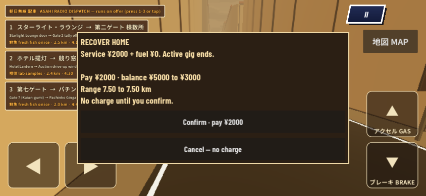
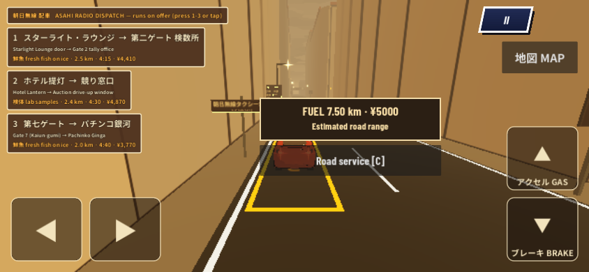
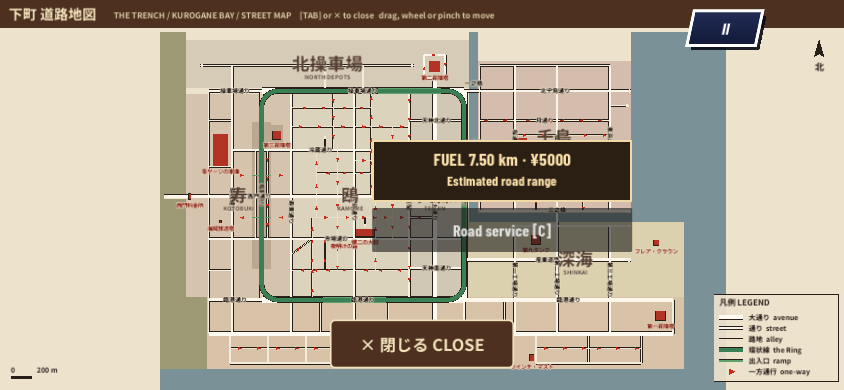

# td-206 P2 modal correction

Tested runtime **825a1db85618e13e3a54de7fcb0ba310df6d734f**, before **70a750ba11fbb83f672ebda060e0d50cc4676798**. This fixes fuel-owned input/pause handling only. PaperMap, shared PauseMenu, map/guide/marker logic and all asset source remain unchanged. [Exact hashes](verification.json).

The old source reproduced four failing browser assertions: Escape left a quote visible with simulation resumed; Tab opened the map beneath it; Cancel then left the map open and simulation running. The correction consumes modal keys before shortcuts/unhandled input, shields background taps, preserves pause ownership across repeated opens, yields to existing map/pause owners, and makes close idempotent. Platform Back cancels a quote; it cannot dismiss game-over. A pausable child records actual gameplay ticks, so tests detect simulation leaking behind the modal. A forced resume is stopped before gameplay physics.

| Final-source check | Result | Evidence |
|---|---|---|
| Existing fuel transactions/recovery/restart | 62 passed | [log](../modal-edge-head.log) |
| Native ownership / Back / repeated and external transitions | 31 passed | [log](../modal-native-head.log) |
| Browser modal tests, portrait and landscape | 35 passed | [probe states](after/result.json) |
| Browser economy / pending quote / reload | 10 passed | [result](economy-web/result.json) |
| Old-source negative control | 4 failed as reproduced, 1 runtime-error check passed | [before states](before/result.json) |

| Same keyboard sequence, initial HQ camera / 844×390 | Before | After |
|---|---|---|
| Quote → Escape |  |  |
| Quote → Tab → Cancel |  |  |

Both final after images, portrait/landscape safe states and actual Web payment pixels were personally inspected. The JSON pairs show the modal/map/paused state; the image alone cannot prove frozen simulation. Browser Back is sent through CDP (Playwright does not expose that named key), and the recorded state shows the quote closes. Native platform Back notification and ui_cancel are tested separately. Software-rendered browser/native checks are not physical phone acceptance.

## Pre-entry assets: accurate per-run counts

The independent reviewer reported **52** pre-entry errors in its separate executor. Our retained original economy run contains **56 over two boots**, not 56 per boot. The new one-boot modal run has **28**; the new two-boot economy run has **56**. Unchanged baseline `389d4a8` reproduces **28 in one boot**, with an identical raw message multiset locally: 8 pole-GLB error events, 18 Showa image-load events, 2 td-119 texture events. All current Lower City entry error counts are **zero**. [Classification and raw messages](asset-error-comparison.json), [baseline observation](baseline-boot-errors.json).

These are run-specific counts; neither the reviewer's 52 nor the recorded worker counts have been relabeled. The reviewer's raw log is not available in this executor, so no unsupported explanation of its four-message difference is asserted. Baseline reproduction establishes the local failures predate fuel; no unrelated assets were fixed.

Natural wreck-event integration, combined PR446 validation and Craig's physical-phone verdict remain open. No Actions, main writes, merge, deployment or NEON changes.
