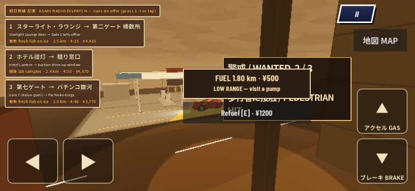
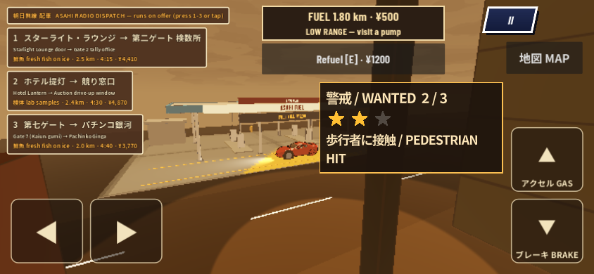
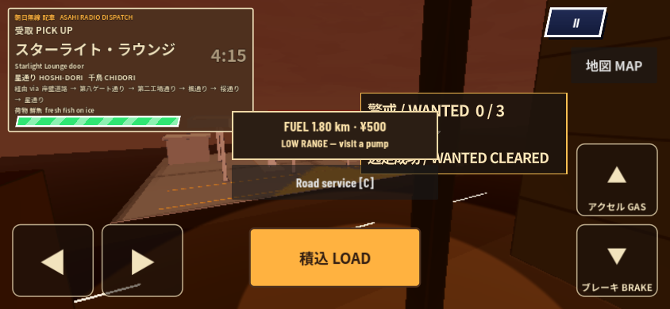
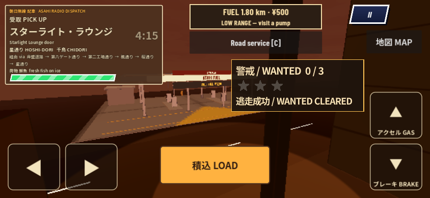
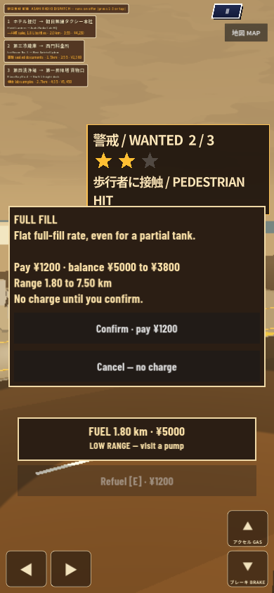
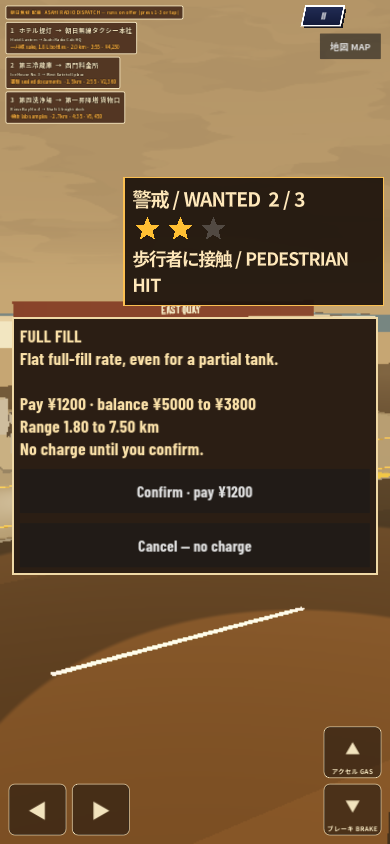

# td-206 FuelHud / Wanted correction — pinned combination only

FuelHud now clears Wanted and existing driving controls at **844×390** and **390×844**. Only `scripts/lower_city/fuel_hud.gd` changes runtime in this correction. It reads visible Control bounds; it never moves/registers/edits Wanted, GigHud, map, pedals, PauseMenu or police. No new shared contract is required for this pinned combination.

Landscape keeps the same 18px range / 14px notice text and 44px action target, with less vertical padding. Candidate positions include live obstacle edges, so expanded Wanted notices and gig pickup controls remain clear. Payment sits beside Wanted in landscape and below it in portrait; landscape Cancel/Retry share a row. The payment contains range/balance and replaces the duplicate fuel card. As before, its input shield pauses gameplay and blocks underlying controls; it can cover the inactive gig card.

## Exact sources

| | Fuel | Dot446 | Local combined commit / tree |
|---|---|---|---|
| Before | `99ca7040e7e8c28439b745a3abb8b02180fa8b36` | `ad531cc69720512984f2e9686b1ec42dbf357d7e` | `d8fa65293cec6fc84acebed5ec8bf29d18196935` / `474760cf42b249b7636ee73edff5f7f489132264` |
| After | `694750e35c52648d03511fc5ebcaf33ea26c3d51` | same pinned dot head | `be4ba060e8508c459c7c963c70ce1acd90022fbc` / `8ea7c38fb156ba9b0c3565100c487efa9f1c671f` |

The combined branch is local only. Runtime merged automatically; documentation conflicts retain both sides. Final source handoff adds QA/docs, with the FuelHud byte hash unchanged from `694750e` (`381c4cfd…d4ae19`). Full hashes and settings: [verification.json](verification.json). Native before/after contain **28 identical camera/viewport pairs**; animation/pedestrian timing is not a pixel-diff threshold.

**This is not current-main acceptance.** Parent reported main `cc875541` after Muse map459 and health461. Dot446 has its own reconciling writer; the parent will align final combined heads. No new map/health work was taken over. The existing Wanted/Gig settlement-card overlap is between those two owners; FuelHud clears both panels and leaves them in place. The natural wreck hook is still unfulfilled: health461's informational BODY counter does not create the authoritative chassis-wreck event.

## Evidence

| Check | Result | Artifact |
|---|---|---|
| Before actual-scene bounds | 43 failed assertions reproduce Wanted/other HUD collisions | [log](before-native.log), [states](before/result.json) |
| After combined native layout | 496 passed; 28 captures | [log](after-native.log), [states](after/result.json) |
| After actual exported browser layout | 496 passed; 28 captures; **0 errors** | [result](web-after/result.json), [log](browser-after-node-fixture.log) |
| Payment vs Wanted, map, pause and pedals | 168 additional recorded-bounds checks passed across native/browser | [checks](additional-modal-bounds.json) |
| Combined fuel economy / arrest / tow regression | 62 passed | [log](combined-fuel-native.log) |
| Combined native modal ownership | 31 passed | [log](combined-modal-native.log) |
| Combined ordinary browser input / modal ownership | 35 passed, 0 city errors | [result](modal-web/result.json), [log](modal-web.log) |
| Fuel-only branch, no Wanted present | 109 HUD/glyph checks passed | [log](fuel-only-native.log) |

States include idle, vehicle hit, pedestrian hit, busted, cleared, low range, low balance, active gig, pickup, settlement, fill, insufficient fill, tow, salvage, insufficient home recovery with Retry, and run-over. Fuel and Wanted states use the actual LowerCity components; test fixtures disable traffic and freeze the car. Ordinary Web modal tests keep normal menu entry and real touch/keyboard input.

| Same camera / state | Before | After |
|---|---|---|
| Landscape low balance / long notice |  |  |
| Landscape pickup |  |  |
| Portrait quote |  |  |

[Actual browser landscape](web-after/landscape-pedestrian-low-balance.png) · [three-button recovery view](web-after/landscape-insufficient-home.png) · [browser portrait payment](web-after/portrait-fill-quote.png) · [all landscape captures](web-landscape-contact.png) · [all portrait captures](web-portrait-contact.png).

The pixels above and contact sheets were personally inspected. Xvfb and Chromium151/SwiftShader phone-sized viewports are **not physical-phone acceptance or performance evidence**. Native retains the previously recorded two GLES shutdown texture leaks. The ordinary browser modal test records the same 28 known pre-entry asset errors; no LowerCity errors. Prior per-run 52/56/28 count distinctions remain in [the modal package](../modal/asset-error-comparison.json); no unrelated asset edits.

## Reproduction

Use Godot4.7.2 (`ed1daf0bf`) and an imported isolated worktree combining the two pinned heads. Native:

```sh
DISPLAY=:99 TD206_SOURCE=694750e35c52648d03511fc5ebcaf33ea26c3d51 \
TD206_DOT_SOURCE=ad531cc69720512984f2e9686b1ec42dbf357d7e \
TD206_COMBINED_TREE=8ea7c38fb156ba9b0c3565100c487efa9f1c671f \
/path/to/Godot --path /tmp/combined/godot --rendering-driver opengl3 \
--audio-driver Dummy --fixed-fps 60 -s tools/test_td206_wanted_layout.gd -- /tmp/layout-proof
```

For browser layout, `tools/export_td206_wanted_qa.py --project /tmp/combined/godot --engine /path/to/Godot --output /tmp/layout-web` makes a **local QA-only** Node wrapper of the same SceneTree fixture and temporarily selects it as the export entry; the original project entry is restored in `finally`. Then run `harness/webgl/td206-wanted-layout.mjs` with `WEB_ROOT=/tmp/layout-web`, `TD206_SOURCE`, `TD206_DOT_SOURCE`, `TD206_COMBINED_TREE`, `TD206_WANTED_OUTPUT` and the installed `PLAYWRIGHT_BROWSERS_PATH`. Exported game/wrapper files are not published. Normal menu input regression uses the ordinary Web export with `td206-modal.mjs`.

Retained attempts: `iteration1` had four failed checks (pickup and three-button home quote), corrected by compact padding/footer; `iteration2` is the candidate pass before exact-commit replay. `incomplete-import-attempt` had resource errors and is not acceptance evidence. Initial export `--script` selection booted the ordinary menu and timed out (`browser-script-attempt`); the explicit QA entry fixes the harness. `fuel-only-wrong-fixture*` is an invalid zero-check run against absent Wanted, not a pass; the combined fixture now fails fast, and the existing fuel-only capture harness supplies the 109-check result.
